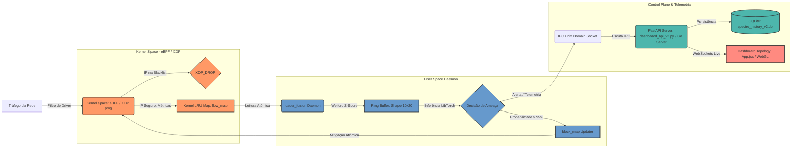

# ⚡ SPECTRE_GRID

[](https://ubuntu.com/)
[](https://ebpf.io/)
[-red?style=for-the-badge&logo=pytorch&logoColor=white)](https://pytorch.org/geometric/html/index.html)
[](https://pytorch.org/cppdocs/)
[](https://fastapi.tiangolo.com/)
[](https://www.sqlite.org/)

O **SPECTRE_GRID** é um ecossistema industrial de Detecção e Prevenção de Intrusão (IDS/IPS) híbrido e de alta performance. O sistema foi desenvolvido para monitorar movimentações laterais, varreduras de portas e ataques complexos (como DDoS) em tempo real, integrando filtros em nível de driver de rede (**eBPF/XDP**) com inteligência artificial geométrica espaço-temporal (**STGNN**).

---

## 📐 Arquitetura do Ecossistema

O sistema opera sob o modelo de **Produtor-Consumidor** de três camadas para garantir latência ultrabaixa de nível de kernel com capacidade cognitiva em tempo real:



### 1. Data Plane (Kernel Space)
*   **eBPF / XDP (`ebpf/spectre_xdp.c`):** Injeta um programa C compilado para bytecode diretamente no driver da placa de rede. Se o IP de origem estiver no mapa hash `block_map`, o pacote é descartado (`XDP_DROP`) com latência na casa dos nanossegundos, blindando o sistema operacional antes de subir para a pilha TCP/IP convencional.
*   **LRU Maps (`flow_map`):** Consolida contadores estatísticos em tempo real (bytes, pacotes, flags SYN, ACK, FIN, RST) associados a uma chave identificadora única de fluxo (5-tuple).

### 2. User Space Daemon (Nativo C++ / Rust)
*   **Motor de Fusão C++ (`ebpf/loader_fusion_v2.cpp`):** Escrito em C++17 com suporte multi-thread, lê do Ring Buffer e alimenta a inferência da LibTorch.
*   **Alternativa em Rust (`loader_fusion_rs/src/main.rs`):** Implementação concorrente com Tokio e bindings `tch-rs` para LibTorch.
*   **Normalização Estática (Welford):** Utiliza médias e desvios padrão dinâmicos calculados online para estabilizar tensores.
*   **Inference Engine (LibTorch):** Carrega o modelo compilado em TorchScript (`spectre_model_scripted.pt`), monta o grafo de relacionamento e executa a inferência relacional da STGNN.

### 3. Control Plane & UI (FastAPI / Go & React WebGL)
*   **IPC via Unix Sockets (`/tmp/spectre.sock`):** Zera o I/O físico de disco removendo arquivos de log intermediários. O Daemon transmite os JSONs diretamente para a memória RAM do backend FastAPI ([dashboard_api_v2.py](file:///c:/Users/abraa/Documents/ids-cnn-lstm-gnn/dashboard_api_v2.py)) ou do Go Server ([main.go](file:///c:/Users/abraa/Documents/ids-cnn-lstm-gnn/dashboard_go/main.go)).
*   **Dashboard Web Premium (`dashboard_v2/`):** React + Vite utilizando a biblioteca `react-force-graph-2d` com aceleração WebGL para renderizar nós (IPs) e arestas (conexões) com física otimizada contra sobrecargas.
*   **SQLite Storage (`spectre_history_v2.db`):** Registra o histórico persistente das ameaças mitigadas usando gravação assíncrona por lotes (batch inserts).

---

## 🧠 Arquitetura de Inteligência Artificial: STGNN

O modelo **STGNN** (Space-Temporal Graph Neural Network) foi treinado e validado com o dataset industrial **CIC-IDS2017 Full Processed** (v1.1) e segue a seguinte estrutura:

```
Entrada: [Nós, Seq_Len = 10, Features = 20]
  │
  ├──► CNN1D (Foco Temporal Local): Extrai padrões locais da série temporal de features do nó.
  │
  ├──► LSTM (Foco Temporal Global): Captura correlações de longo prazo no histórico de pacotes.
  │
  ├──► GATConv (Foco Espacial Topológico): Realiza o Message Passing no grafo da rede. 
  │    (Nós = IPs, Arestas = Fluxos Ativos). Usa pesos de atenção para detectar varreduras e movimentos laterais.
  │
  └──► Classificador FC (Fully Connected): Gera logits binários calibrados com BCEWithLogitsLoss.
```

### Métricas de Validação de Produção
*   **F1-Score Geral:** `0.9856`
*   **Latência de Inferência:** `1.5ms`
*   **Resiliência Topológica:** Otimizado contra o *Synthetic Graph Paradox* (garantindo estabilidade topológica do grafo durante simulações massivas).

---

## 📁 Estrutura de Arquivos

*   [model.py](file:///c:/Users/abraa/Documents/ids-cnn-lstm-gnn/model.py): Implementação da rede neural `SPECTRE_GRID` (com suporte retrocompatível ao alias `Super_IDS_Net`).
*   [train.py](file:///c:/Users/abraa/Documents/ids-cnn-lstm-gnn/train.py): Pipeline de treino usando os grafos do PyTorch Geometric `.pt`.
*   [preprocessor.py](file:///c:/Users/abraa/Documents/ids-cnn-lstm-gnn/preprocessor.py): Engenharia de dados e seleção automática das **Top-20 Features de Pearson**.
*   [inference.py](file:///c:/Users/abraa/Documents/ids-cnn-lstm-gnn/inference.py): Módulo demonstrativo de inferência com tensores dummy.
*   [validate_parity.py](file:///c:/Users/abraa/Documents/ids-cnn-lstm-gnn/validate_parity.py): Compara a coerência de saída entre o código Python e o bytecode LibTorch C++.
*   [main.cpp](file:///c:/Users/abraa/Documents/ids-cnn-lstm-gnn/main.cpp): Wrapper C++ legado para execução direta do modelo.
*   [ebpf/](file:///c:/Users/abraa/Documents/ids-cnn-lstm-gnn/ebpf): Códigos-fonte do driver Kernel Space (`spectre_xdp.c`), do motor C++ v2 (`loader_fusion_v2.cpp`) e da versão legada (`loader_fusion_legacy.cpp`).
*   [loader_fusion_rs/](file:///c:/Users/abraa/Documents/ids-cnn-lstm-gnn/loader_fusion_rs): Implementação concorrente alternativa em Rust.
*   [dashboard_go/](file:///c:/Users/abraa/Documents/ids-cnn-lstm-gnn/dashboard_go): Backend alternativo em Go de altíssima performance.
*   [deploy/](file:///c:/Users/abraa/Documents/ids-cnn-lstm-gnn/deploy): Scripts de provisionamento automatizado do Systemd daemon para Linux Enterprise.
*   [scratch/](file:///c:/Users/abraa/Documents/ids-cnn-lstm-gnn/scratch): Scripts utilitários de simulação contínua, estresse de rede (ex: `real_syn_flood.py`, `udp_flood.py`) e controle.

---

## ⚡ Guia de Execução Rápida

### ⚠️ Regra de Ouro (WSL2 / Performance)
> [!CAUTION]
> Toda a compilação do motor C++ e a execução do ambiente de Machine Learning **devem ser efetuadas no sistema de arquivos nativo do Linux** (`~/ids-cnn-lstm-gnn/`).
> Nunca execute ou compile cruzando caminhos montados do Windows (`/mnt/c/`), pois a latência do protocolo 9P resultará em degradação extrema da CPU e problemas graves de I/O de dados.

### 1. Preparando o Ambiente Virtual Linux
```bash
# Navegar até a raiz Linux nativa
mkdir -p ~/ids-cnn-lstm-gnn
cd ~/ids-cnn-lstm-gnn

# Configurar o ambiente virtual
python3 -m venv .venv_wsl
source .venv_wsl/bin/activate

# Instalar dependências nativas (com suporte a CUDA 12.4 se disponível)
pip install --upgrade pip
pip install torch torchvision torchaudio --index-url https://download.pytorch.org/whl/cu124
pip install torch_geometric pandas numpy fastapi uvicorn websockets sqlite3
```

### 2. Configurando o Driver eBPF/XDP
```bash
# Conceder permissão e executar script de carregamento de dependências Linux (clang, llvm, libbpf)
chmod +x setup_ebpf_env.sh
sudo ./setup_ebpf_env.sh
```

### 3. Compilando o Daemon nativo C++ (LibTorch)
Certifique-se de configurar a variável de ambiente `LibTorch_DIR` apontando para os cabeçalhos LibTorch de C++ antes do build:
```bash
mkdir -p build && cd build
cmake -DCMAKE_PREFIX_PATH=/caminho/para/libtorch -DCMAKE_BUILD_TYPE=Release ..
cmake --build .
```

### 4. Executando o Dashboard & Control Plane (FastAPI V2 ou Go)
```bash
# Iniciar o servidor FastAPI que ficará escutando o Socket IPC (Porta 8001)
python3 dashboard_api_v2.py
```
Ou usando a alternativa em Go:
```bash
cd dashboard_go
go run main.go
```
Acesse o painel web premium em seu navegador através do endereço `http://localhost:8001`.

### 5. Implantação Enterprise com Systemd
Para provisionar a solução em background em servidores de produção:
```bash
cd deploy/
sudo chmod +x install_services.sh
sudo ./install_services.sh

# Iniciar todos os daemons unificados
sudo systemctl start spectre-fusion spectre-api spectre-web
```

---

## 📅 Roadmap de Desenvolvimento

| Fase | Tecnologia Central | Melhoria Proposta | Status |
| :--- | :--- | :--- | :--- |
| **Fase 1** | Unix Domain Sockets (IPC) | Zera o I/O físico de escrita em disco na telemetria crítica. | **CONCLUÍDO** ✅ |
| **Fase 2** | eBPF Ring Buffer | Eliminação completa do Polling do daemon C++ usando modelo Push. | *Planejado* ⏳ |
| **Fase 3** | C++ Multi-Threading | Isolamento do plano de dados (Ring Buffer) do plano de inferência (IA). | *Planejado* ⏳ |
| **Fase 4** | WebGL Rendering (PixiJS) | Otimização geométrica do grafo para renderizar 1000+ nós a 60 FPS. | *Planejado* ⏳ |

---

## 🏛️ Contexto Acadêmico

O **SPECTRE_GRID** é parte do projeto de pesquisa em cibersegurança e redes inteligentes desenvolvido no **IFC Brusque**. O projeto iniciou usando amostras do dataset NSL-KDD e evoluiu para o CIC-IDS2017 para refletir as necessidades de detecção contra vetores de ataques de próxima geração. O histórico completo de iterações do Git e análises estruturais de pesquisa estão consolidados no arquivo [research_history_log.md](file:///c:/Users/abraa/Documents/ids-cnn-lstm-gnn/research_history_log.md).
