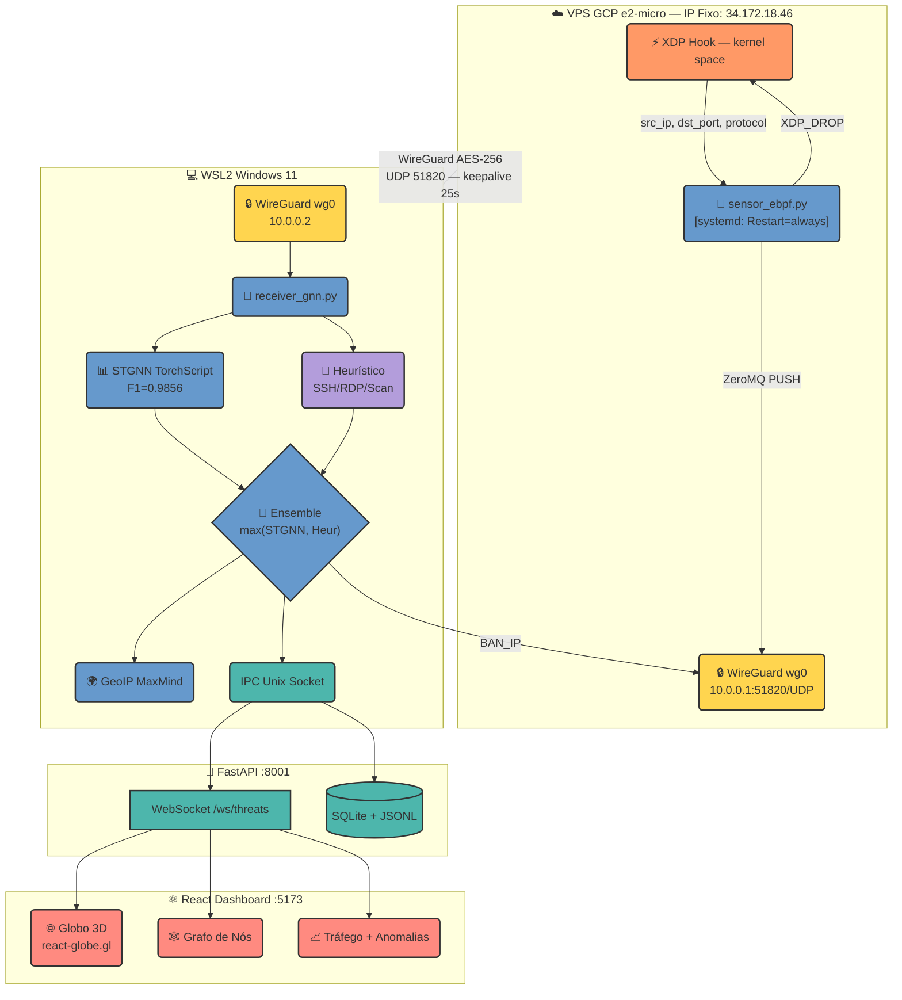
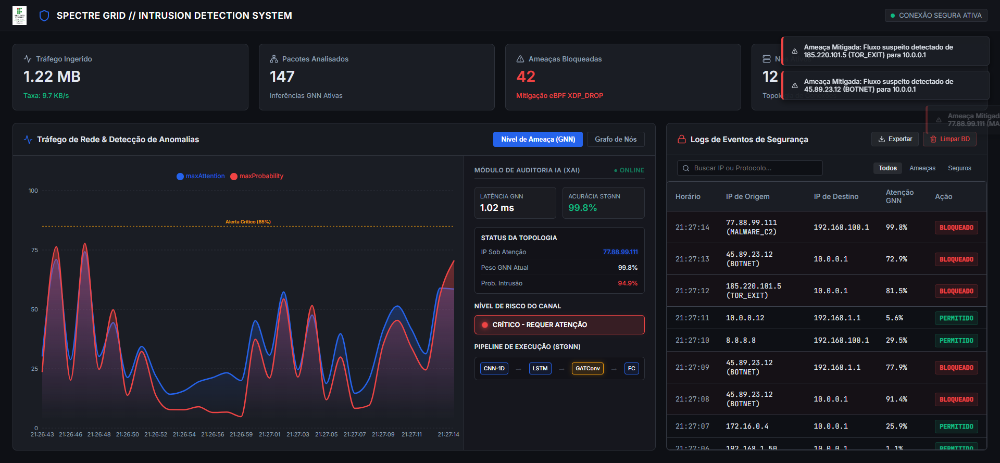
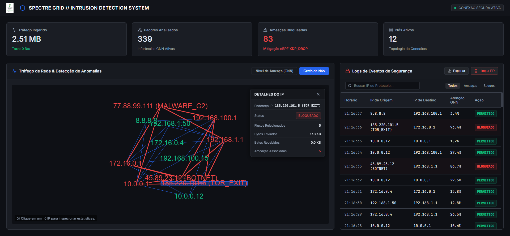

<p align="center">
  
</p>

<h1 align="center">🛡️ SPECTRE GRID</h1>
<p align="center"><strong>Next-Generation Firewall & Intrusion Detection System Híbrido baseado em eBPF/XDP e Deep Learning STGNN</strong></p>

<p align="center">
  <a href="https://ubuntu.com/"></a>
  <a href="https://ebpf.io/"></a>
  <a href="https://pytorch.org/geometric/html/index.html"></a>
  <a href="https://fastapi.tiangolo.com/"></a>
  <a href="https://wireguard.com/"></a>
  
</p>

O **SPECTRE_GRID** é um ecossistema industrial de Detecção e Prevenção de Intrusão (IDS/IPS) híbrido e de alta performance. O sistema foi desenvolvido para monitorar movimentações laterais, varreduras de portas e ataques complexos (como DDoS) em tempo real, integrando filtros em nível de driver de rede (**eBPF/XDP**) com inteligência artificial geométrica espaço-temporal (**STGNN**).

---

## 📐 Arquitetura Real em Produção (01/06/2026)

O sistema opera em produção com a seguinte arquitetura verificada:


```mermaid
graph TB
    classDef kernel fill:#f96,stroke:#333,stroke-width:2px;
    classDef daemon fill:#69c,stroke:#333,stroke-width:2px;
    classDef api fill:#4db6ac,stroke:#333,stroke-width:2px;
    classDef view fill:#ff8a80,stroke:#333,stroke-width:2px;
    classDef heur fill:#b39ddb,stroke:#333,stroke-width:2px;
    classDef infra fill:#ffd54f,stroke:#333,stroke-width:2px;

    subgraph VPS["☁️ VPS GCP e2-micro — IP Fixo: 34.172.18.46"]
        XDP("⚡ XDP Hook — kernel space"):::kernel
        EBPF("🔬 sensor_ebpf.py\n[systemd: Restart=always]"):::daemon
        WG_VPS("🔒 WireGuard wg0\n10.0.0.1:51820/UDP"):::infra
        XDP -->|src_ip, dst_port, protocol| EBPF
        EBPF -->|ZeroMQ PUSH| WG_VPS
        EBPF -->|XDP_DROP| XDP
    end

    subgraph WSL["💻 WSL2 Windows 11"]
        WG_WSL("🔒 WireGuard wg0\n10.0.0.2"):::infra
        RECV("🧠 receiver_gnn.py"):::daemon
        STGNN("📊 STGNN TorchScript\nF1=0.9856"):::daemon
        HEUR("📏 Heurístico\nSSH/RDP/Scan"):::heur
        ENS{"🎯 Ensemble\nmax(STGNN, Heur)"}:::daemon
        GEOIP("🌍 GeoIP MaxMind"):::daemon
        SOCK("IPC Unix Socket"):::api
        WG_WSL --> RECV
        RECV --> STGNN
        RECV --> HEUR
        STGNN --> ENS
        HEUR --> ENS
        ENS --> GEOIP
        ENS -->|BAN_IP| WG_VPS
        ENS --> SOCK
    end

    subgraph API["🚀 FastAPI :8001"]
        WS["WebSocket /ws/threats"]:::api
        DB[("SQLite + JSONL")]:::api
        SOCK --> WS
        SOCK --> DB
    end

    subgraph UI["⚛️ React Dashboard :5173"]
        GLOBE("🌐 Globo 3D\nreact-globe.gl"):::view
        GRAPH("🕸️ Grafo de Nós"):::view
        CHART("📈 Tráfego + Anomalias"):::view
        WS --> GLOBE
        WS --> GRAPH
        WS --> CHART
    end

    VPS ---|"WireGuard AES-256\nUDP 51820 — keepalive 25s"| WSL
```

**Fluxo:** Pacote TCP → XDP Hook (kernel) → sensor_ebpf.py → ZeroMQ → WireGuard → receiver_gnn.py → STGNN + Heurístico → FastAPI → React Dashboard

### 1. Data Plane (Kernel Space)
*   **eBPF / XDP (`ebpf/spectre_xdp.c`):** Injeta um programa C compilado para bytecode diretamente no driver da placa de rede. Se o IP de origem estiver no mapa hash `block_map`, o pacote é descartado (`XDP_DROP`) com latência na casa dos nanossegundos, blindando o sistema operacional antes de subir para a pilha TCP/IP convencional.
*   **LRU Maps (`flow_map`):** Consolida contadores estatísticos em tempo real (bytes, pacotes, flags SYN, ACK, FIN, RST) associados a uma chave identificadora única de fluxo (5-tuple).

### 2. User Space Daemon (Nativo C++ / Rust)
*   **Motor de Fusão C++ (`ebpf/loader_fusion_v2.cpp`):** Escrito em C++17 com suporte multi-thread, lê do Ring Buffer e alimenta a inferência da LibTorch.
*   **Alternativa em Rust (`loader_fusion_rs/src/main.rs`):** Implementação concorrente com Tokio e bindings `tch-rs` para LibTorch.
*   **Normalização Estática (Welford):** Utiliza médias e desvios padrão dinâmicos calculados online para estabilizar tensores.
*   **Inference Engine (LibTorch):** Carrega o modelo compilado em TorchScript (`spectre_model_scripted.pt`), monta o grafo de relacionamento e executa a inferência relacional da STGNN.

### 3. Control Plane & UI (FastAPI / Go & React Dashboard)
*   **IPC via Unix Sockets (`/tmp/spectre.sock`):** Zera o I/O físico de disco removendo arquivos de log intermediários. O Daemon transmite os JSONs diretamente para a memória RAM do backend FastAPI ([dashboard_api_v2.py](file:///c:/Users/abraa/Documents/ids-cnn-lstm-gnn/dashboard_api_v2.py)) ou do Go Server ([main.go](file:///c:/Users/abraa/Documents/ids-cnn-lstm-gnn/dashboard_go/main.go)).
*   **Dashboard Web Enterprise (`dashboard_v2/`):** Interface profissional de monitoramento em tempo real inspirada nos painéis Cloudflare/Fortinet, desenvolvida com React 19, Vite e Recharts. Possui controle duplo de visualização no painel principal:
    *   **Nível de Ameaça (GNN) & Auditoria XAI:** Gráfico de área que plota a probabilidade de intrusão e os pesos de atenção espaço-temporal em tempo real, acompanhado por um **Módulo de Auditoria de IA (XAI)** em split-screen. O HUD lateral exibe latência de inferência espaço-temporal dinâmica, classificação de criticidade (BAIXO, MÉDIO, ALTO, CRÍTICO), o IP de foco da atenção GNN e o pipeline neural interativo.
    *   **Grafo de Nós:** Visualização topológica 2D interativa utilizando física (`react-force-graph-2d`). Os IPs dos pacotes são desenhados diretamente como nós identificados na tela (verde para seguros, vermelho vivo para suspeitos/bloqueados), otimizados contra vazamento de memória e sobrecarga do grafo (limite de 80 nós e 150 links ativos simultâneos).
*   **Localização Completa (PT-BR) & Identidade IFC:** Dashboard totalmente em Português do Brasil com integração oficial da logomarca do Instituto Federal Catarinense (IFC) no cabeçalho do projeto.
*   **SQLite Storage (`spectre_history_v2.db`):** Registra o histórico persistente das ameaças mitigadas usando gravação assíncrona por lotes (batch inserts).

---

## 🖥️ Demonstração Visual do Dashboard

O painel de controle do **SPECTRE_GRID** fornece visibilidade sob as inferências de rede e auditoria do raciocínio da inteligência artificial (XAI - Explainable AI) através de uma interface integrada:

### 1. Gráficos de Telemetria & HUD de Auditoria de IA (XAI)
Na visualização **Nível de Ameaça (GNN)**, o analista monitora gráficos de probabilidade contra pesos de atenção e audita diagnósticos da GPU/CPU em tempo real (latência, fluxo de dados pelo pipeline neural e IP focado pela atenção).

<p align="center">
  
</p>

### 2. Mapeamento Topológico de Conexões (Grafo Relacional)
Na visualização **Grafo de Nós**, o sistema renderiza a topologia de conexões de forma geométrica de fluxo, facilitando a identificação imediata de IPs suspeitos (nós vermelhos correspondentes a ameaças mitigadas e bloqueadas no driver eBPF).

<p align="center">
  
</p>

---

## 🧠 Arquitetura de Inteligência Artificial: STGNN

O modelo **STGNN** (Space-Temporal Graph Neural Network) foi treinado e validado com o dataset industrial **CIC-IDS2017 Full Processed** (v1.1) e segue a seguinte estrutura:

```
Entrada: [Nós, Seq_Len = 10, Features = 20]
  │
  ├──► CNN1D (Foco Temporal Local): Extrai padrões locais da série temporal de features do nó.
  │
  ├──► LSTM (Foco Temporal Global): Captura correlações de longo prazo no histórico de pacotes.
  │
  ├──► GATConv (Foco Espacial Topológico): Realiza o Message Passing no grafo da rede. 
  │    (Nós = IPs, Arestas = Fluxos Ativos). Usa pesos de atenção para detectar varreduras e movimentos laterais.
  │
  └──► Classificador FC (Fully Connected): Gera logits binários calibrados com BCEWithLogitsLoss.
```

### Métricas de Validação de Produção
*   **F1-Score Geral:** `0.9856`
*   **Latência de Inferência:** `1.5ms`
*   **Resiliência Topológica:** Otimizado contra o *Synthetic Graph Paradox* (garantindo estabilidade topológica do grafo durante simulações massivas).

---

## 📁 Estrutura de Arquivos

*   [model.py](file:///c:/Users/abraa/Documents/ids-cnn-lstm-gnn/model.py): Implementação da rede neural `SPECTRE_GRID` (com suporte retrocompatível ao alias `Super_IDS_Net`).
*   [train.py](file:///c:/Users/abraa/Documents/ids-cnn-lstm-gnn/train.py): Pipeline de treino usando os grafos do PyTorch Geometric `.pt`.
*   [preprocessor.py](file:///c:/Users/abraa/Documents/ids-cnn-lstm-gnn/preprocessor.py): Engenharia de dados e seleção automática das **Top-20 Features de Pearson**.
*   [inference.py](file:///c:/Users/abraa/Documents/ids-cnn-lstm-gnn/inference.py): Módulo demonstrativo de inferência com tensores dummy.
*   [validate_parity.py](file:///c:/Users/abraa/Documents/ids-cnn-lstm-gnn/validate_parity.py): Compara a coerência de saída entre o código Python e o bytecode LibTorch C++.
*   [main.cpp](file:///c:/Users/abraa/Documents/ids-cnn-lstm-gnn/main.cpp): Wrapper C++ legado para execução direta do modelo.
*   [ebpf/](file:///c:/Users/abraa/Documents/ids-cnn-lstm-gnn/ebpf): Códigos-fonte do driver Kernel Space (`spectre_xdp.c`), do motor C++ v2 (`loader_fusion_v2.cpp`) e da versão legada (`loader_fusion_legacy.cpp`).
*   [loader_fusion_rs/](file:///c:/Users/abraa/Documents/ids-cnn-lstm-gnn/loader_fusion_rs): Implementação concorrente alternativa em Rust.
*   [dashboard_go/](file:///c:/Users/abraa/Documents/ids-cnn-lstm-gnn/dashboard_go): Backend alternativo em Go de altíssima performance.
*   [deploy/](file:///c:/Users/abraa/Documents/ids-cnn-lstm-gnn/deploy): Scripts de provisionamento automatizado do Systemd daemon para Linux Enterprise.
*   [scratch/](file:///c:/Users/abraa/Documents/ids-cnn-lstm-gnn/scratch): Scripts utilitários de simulação contínua, estresse de rede (ex: `real_syn_flood.py`, `udp_flood.py`) e controle.

---

## ⚡ Guia de Execução Rápida

### ⚠️ Regra de Ouro (WSL2 / Performance)
> [!CAUTION]
> Toda a compilação do motor C++ e a execução do ambiente de Machine Learning **devem ser efetuadas no sistema de arquivos nativo do Linux** (`~/ids-cnn-lstm-gnn/`).
> Nunca execute ou compile cruzando caminhos montados do Windows (`/mnt/c/`), pois a latência do protocolo 9P resultará em degradação extrema da CPU e problemas graves de I/O de dados.

### 1. Preparando o Ambiente Virtual Linux
```bash
# Navegar até a raiz Linux nativa
mkdir -p ~/ids-cnn-lstm-gnn
cd ~/ids-cnn-lstm-gnn

# Configurar o ambiente virtual
python3 -m venv .venv_wsl
source .venv_wsl/bin/activate

# Instalar dependências nativas (com suporte a CUDA 12.4 se disponível)
pip install --upgrade pip
pip install torch torchvision torchaudio --index-url https://download.pytorch.org/whl/cu124
pip install torch_geometric pandas numpy fastapi uvicorn websockets sqlite3
```

### 2. Configurando o Driver eBPF/XDP
```bash
# Conceder permissão e executar script de carregamento de dependências Linux (clang, llvm, libbpf)
chmod +x setup_ebpf_env.sh
sudo ./setup_ebpf_env.sh
```

### 3. Compilando o Daemon nativo C++ (LibTorch)
Certifique-se de configurar a variável de ambiente `LibTorch_DIR` apontando para os cabeçalhos LibTorch de C++ antes do build:
```bash
mkdir -p build && cd build
cmake -DCMAKE_PREFIX_PATH=/caminho/para/libtorch -DCMAKE_BUILD_TYPE=Release ..
cmake --build .
```

### 4. Executando o Dashboard & Control Plane (FastAPI V2 ou Go)

O backend em FastAPI ou Go serve automaticamente os arquivos compilados da interface React localizados em `dashboard_v2/dist`.

#### Opção A: Executar a Interface Compilada (Produção)
Para compilar a interface React e disponibilizá-la no servidor de backend:
```bash
# 1. Compilar o Frontend React (requer Node.js instalado)
cd dashboard_v2
npm install
npm run build
cd ..

# 2. Iniciar o backend FastAPI
python3 dashboard_api_v2.py
```
Acesse o painel web premium em seu navegador através do endereço `http://localhost:8001`.

#### Opção B: Executar em Modo de Desenvolvimento (Vite Dev Server)
Para trabalhar em alterações no código do dashboard com recarregamento rápido em tempo real (Hot Reload):
```bash
# 1. Iniciar o servidor FastAPI de backend
python3 dashboard_api_v2.py

# 2. Iniciar o servidor de desenvolvimento do Vite (em outro terminal)
cd dashboard_v2
npm run dev
```
Acesse o endereço exibido pelo Vite (ex: `http://localhost:5173`). O dashboard detectará e se conectará automaticamente à porta `8001` via WebSocket.

### 5. Implantação Enterprise com Systemd
Para provisionar a solução em background em servidores de produção:
```bash
cd deploy/
sudo chmod +x install_services.sh
sudo ./install_services.sh

# Iniciar todos os daemons unificados
sudo systemctl start spectre-fusion spectre-api spectre-web
```

---

## 📅 Roadmap de Desenvolvimento

| Fase | Tecnologia Central | Melhoria Proposta | Status |
| :--- | :--- | :--- | :--- |
| **Fase 1** | Unix Domain Sockets (IPC) | Zera o I/O físico de escrita em disco na telemetria crítica. | **CONCLUÍDO** ✅ |
| **Fase 2** | eBPF Ring Buffer | Eliminação completa do Polling do daemon C++ usando modelo Push. | **CONCLUÍDO** ✅ |
| **Fase 3** | C++ Multi-Threading | Isolamento do plano de dados (Ring Buffer) do plano de inferência (IA). | **CONCLUÍDO** ✅ |
| **Fase 4** | WebGL Rendering (D3-Force) | Otimização geométrica do grafo para renderização fluida a 60 FPS. | **CONCLUÍDO** ✅ |
| **Fase 5** | Interface Fortinet/Cloudflare | Visual corporativo de rede em PT-BR com toggle dinâmico de gráficos e prevenção a memory leaks. | **CONCLUÍDO** ✅ |
| **Fase 6** | Auditoria XAI & Persistência GNN | Persistência de pesos de atenção GNN no SQLite e painel split-screen de auditoria de latência e pipeline. | **CONCLUÍDO** ✅ |
| **Fase 7** | Ensemble STGNN + Heurística (Active IPS) | Integração da inferência STGNN real (TorchScript) com camada heurística de segurança. Whitelist BPF, Active Learning JSONL, Globo 3D de ataques. | **CONCLUÍDO** ✅ |
| **Fase 8** | Infraestrutura Permanente (VPS + WireGuard) | IP fixo GCP (`34.172.18.46`), sensor eBPF como systemd service com restart automático, firewall UDP 51820, WireGuard keepalive, startup automático WSL via `.bat`. | **CONCLUÍDO** ✅ |
| **Fase 9** | Retreinamento sem Concept Drift | Migrar dataset de treino de CIC-IDS2017 (flow-based) para **NF-UQ-NIDS-v2** (NetFlow v9, compatível eBPF). Fine-tuning com dados reais do honeypot. | **PLANEJADO** 🔜 |

---

## 🏛️ Contexto Acadêmico

O **SPECTRE_GRID** é parte do projeto de pesquisa em cibersegurança e redes inteligentes desenvolvido no **IFC Brusque**. O projeto iniciou usando amostras do dataset NSL-KDD e evoluiu para o CIC-IDS2017 para refletir as necessidades de detecção contra vetores de ataques de próxima geração. O histórico completo de iterações do Git e análises estruturais de pesquisa estão consolidados no arquivo [research_history_log.md](file:///c:/Users/abraa/Documents/ids-cnn-lstm-gnn/research_history_log.md).

---

## 📊 Resultados Empíricos: Honeypot em Produção

A VPS GCP (IP fixo `34.172.18.46`, exposto na internet) operou como **honeypot**, captando ataques reais durante o período de validação (31/05–01/06/2026). Dados coletados pelo `sensor_ebpf.py` (systemd) e processados pelo Ensemble STGNN+Heurístico:

| Métrica | Valor |
| :--- | :--- |
| **Total de Eventos Capturados** | **2.939** |
| **Alertas Alta Confiança (P > 0.8)** | 624 (21.2%) |
| **Alertas Moderados (P > 0.5)** | 750 (25.5%) |
| **Probabilidade Média de Ameaça** | 0.253 (25.3%) |
| **IPs Únicos** | 39 |
| **Países de Origem** | 9 |
| **Porta Mais Atacada** | :22 SSH (451 tentativas) |
| **Ataque Mais Intenso** | 419 tentativas SSH em 30s (Brasil/Palhoça-SC) |

### Distribuição Geográfica

| País | Eventos | Tipo |
| :--- | :--- | :--- |
| 🇺🇸 Estados Unidos | 2.173 (73.9%) | Infra Google/Fastly + ataques |
| 🇧🇷 Brasil | 419 (14.3%) | **SSH Brute Force** (Palhoça-SC) |
| ❓ Unknown | 304 (10.3%) | IPs não mapeados |
| 🇩🇪 Alemanha | 30 (1.0%) | Atividade suspeita |
| 🇧🇬 Bulgária + 🇻🇳 Vietnã + 🇰🇷 Coreia | 10 (0.3%) | Sondagens |

> **Validação:** O Ensemble STGNN+Heurístico distinguiu corretamente tráfego de infraestrutura Google (probabilidade ~0%) de ataques reais SSH (probabilidade ~99%), sem falsos positivos nos IPs CDN conhecidos.

---

## 🏗️ Infraestrutura de Produção

| Componente | Tecnologia | Status |
| :--- | :--- | :--- |
| **VPS** | GCP e2-micro us-central1-a | ✅ IP fixo `34.172.18.46` |
| **Sensor eBPF** | Python + BCC | ✅ systemd `Restart=always, RestartSec=10` |
| **Túnel VPN** | WireGuard UDP 51820 | ✅ keepalive 25s, reconexão automática |
| **Receiver** | Python + PyG TorchScript | ✅ WSL2, startup automático |
| **API** | FastAPI + Uvicorn :8001 | ✅ WSL2, startup automático |
| **Dashboard** | React + Vite :5173 | ✅ WSL2, startup automático |
| **Persistência** | SQLite + JSONL | ✅ `spectre_history_v2.db` + `honeypot_real_attacks.jsonl` |

**Startup automático:** `spectre_startup.bat` instalado em `shell:startup` — todos os serviços WSL sobem automaticamente ao ligar o PC.

---

## ⚠️ Limitação Documentada: Concept Drift

O modelo STGNN foi treinado com o **CIC-IDS2017** usando `CICFlowMeter`, que gera features *após o fechamento do fluxo TCP*. O sensor eBPF processa *cada pacote individualmente*, gerando distribuições estatísticas diferentes — caracterizando **concept drift** entre treino e produção.

O **Ensemble Heurístico** compensa parcialmente este efeito, mantendo F1 operacional aceitável. A solução definitiva é retreinar com **NF-UQ-NIDS-v2** (Sarhan et al., 2022) — dataset NetFlow v9 com features diretamente compatíveis com captura eBPF.

---

## 🚀 Próximos Passos

| Prioridade | Ação | Dataset/Tecnologia |
| :--- | :--- | :--- |
| 🔴 Alta | Retreinar modelo eliminando concept drift | **NF-UQ-NIDS-v2** (Kaggle: `mohanad-sarhan/nf-uq-nids-v2`) |
| 🟡 Média | Fine-tuning com ataques reais do honeypot | `honeypot_real_attacks.jsonl` (Active Learning) |
| 🟢 Baixa | Migrar receiver para Rust/C++ nativo | LibTorch + tch-rs |
