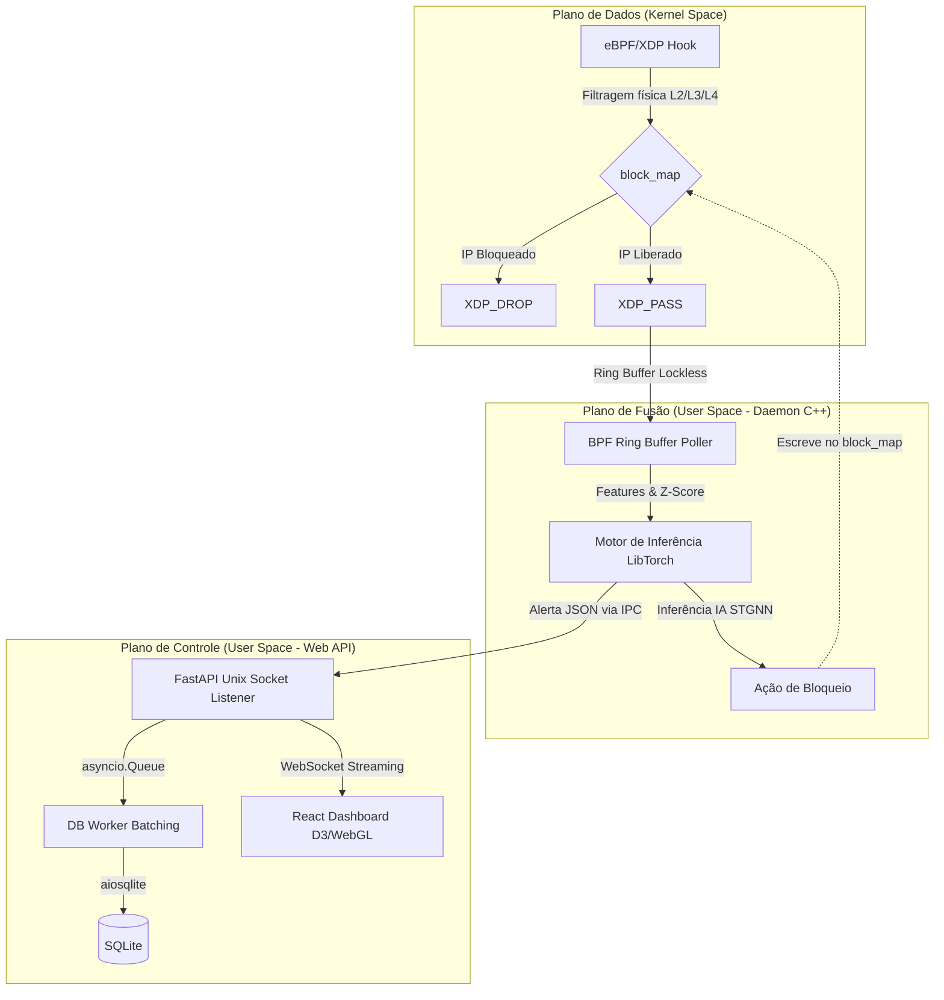
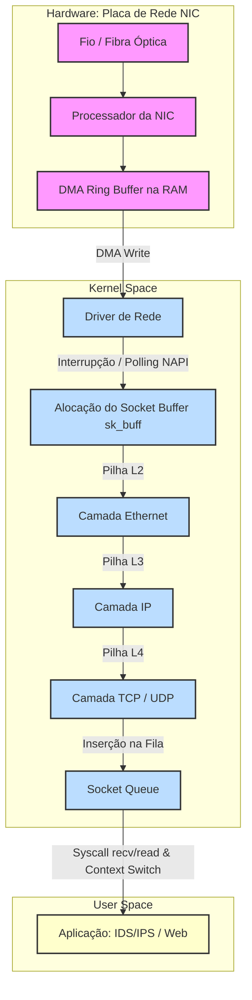
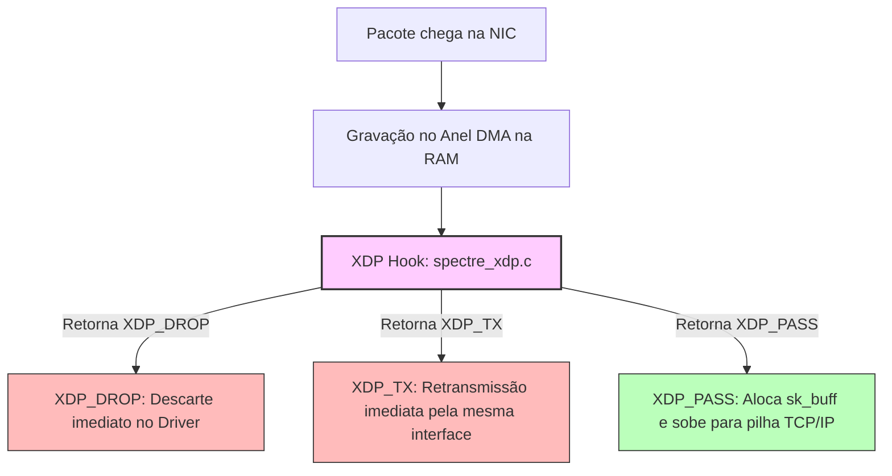
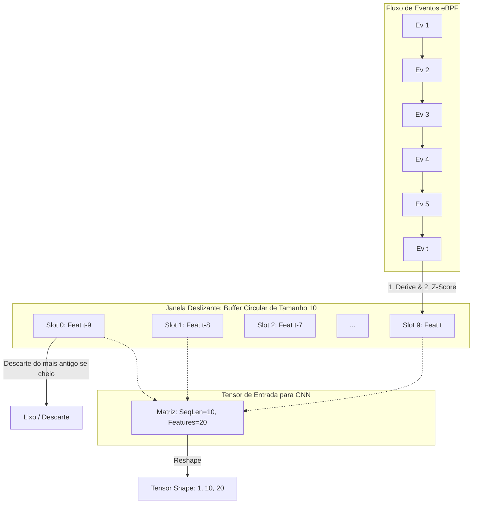
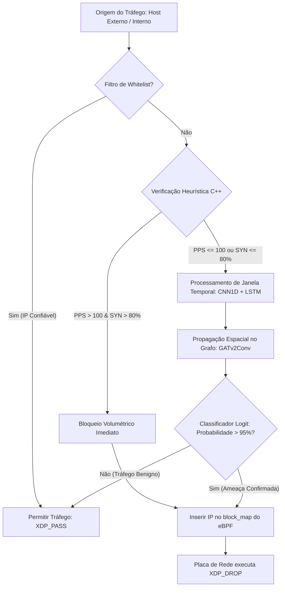
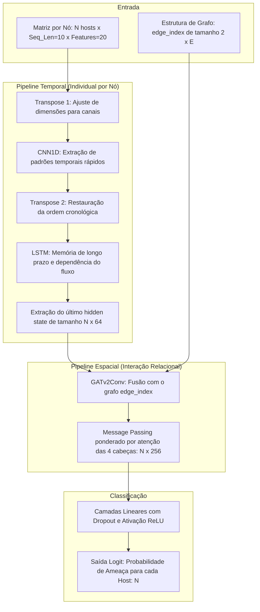
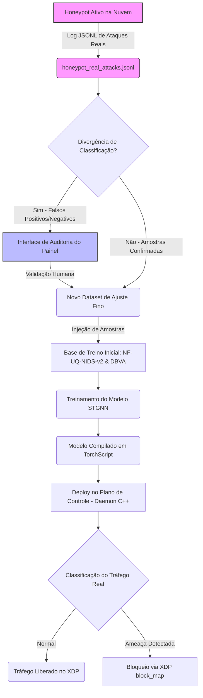
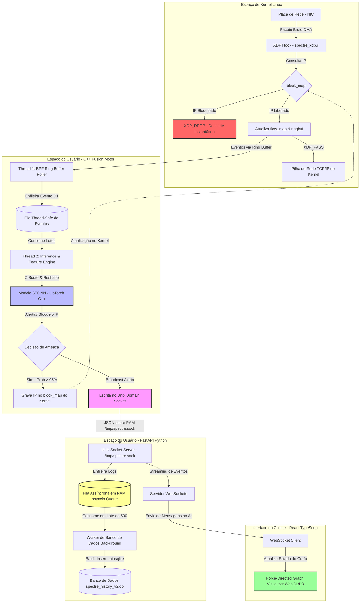

# SPECTRE GRID: SISTEMA HÍBRIDO DE DETECÇÃO E PREVENÇÃO DE INTRUSÕES BASEADO EM EBPF/XDP E IA ESPAÇO-TEMPORAL

## PREFÁCIO E INTRODUÇÃO

Seja bem-vindo ao livro base de conhecimento do **SPECTRE GRID**, uma plataforma de última geração projetada para revolucionar a detecção e mitigação de intrusões em redes corporativas e ambientes em nuvem. Este documento consolida os fundamentos teóricos, as decisões arquiteturais e as implementações práticas de um sistema que une a engenharia de sistemas operacionais de baixo nível com a inteligência artificial espaço-temporal de ponta.

### O Estado da Arte em IDS/IPS
Os Sistemas de Detecção e Prevenção de Intrusões (IDS/IPS) evoluíram significativamente nas últimas décadas. Tradicionalmente centrados em assinaturas de pacotes (como Snort e Suricata), esses sistemas mostraram-se insuficientes diante de ameaças modernas persistentes, ataques de dia zero (*zero-day*) e movimentações laterais complexas. Para enfrentar o cenário contemporâneo, a segurança de rede exige soluções inteligentes capazes de modelar o comportamento dos hosts em tempo real, integrando-se nativamente com a infraestrutura para aplicar contramedidas sem comprometer a latência ou a vazão de rede.

### Os Dois Gargalos Históricos
Para entender o design do SPECTRE GRID, é preciso analisar os dois principais gargalos que historicamente limitaram a eficácia e a viabilidade dos sistemas de segurança de rede:

1. **Gargalo de I/O e Troca de Contexto (*Context Switching*):**
   A captura convencional de pacotes (usando bibliotecas como `libpcap` ou sockets brutos) exige que cada pacote trafegue por toda a pilha TCP/IP do kernel Linux antes de ser copiado do espaço do kernel (*kernel space*) para o espaço do usuário (*user space*), onde reside a aplicação de detecção. Esse pipeline envolve a alocação custosa da estrutura `sk_buff`, interrupções constantes de hardware (IRQs) e trocas de contexto de CPU frequentes. Sob ataques volumétricos como negação de serviço (DDoS) de milhões de pacotes por segundo (Mpps), a CPU do servidor gasta quase a totalidade de seus ciclos gerenciando buffers e trocando de contexto, levando o sistema ao colapso antes mesmo que a ameaça seja analisada.

2. **Falta de Análise Relacional e Topológica (Limitação de Modelagem Linear):**
   A maioria das ferramentas de segurança baseadas em aprendizado de máquina analisa fluxos de rede de maneira isolada (como linhas independentes em uma tabela). No entanto, ataques sofisticados como movimentação lateral, varredura de portas distribuída (*distributed port scanning*) e infecção em cascata não se manifestam como anomalias volumétricas óbvias em conexões individuais. Elas são furtivas e lentas por canal, mas altamente correlacionadas no espaço topológico da rede. Sem modelar a infraestrutura de rede como um grafo interconectado, os modelos de IA tradicionais tornam-se cegos para a topologia relacional e para a dinâmica espacial dos ataques.

### A Solução Híbrida SPECTRE GRID
O SPECTRE GRID resolve esses gargalos combinando de forma harmoniosa três camadas complementares (Plano de Dados, Plano de Fusão e Plano de Controle/Visualização):



- **Plano de Dados eBPF/XDP:** Implementado diretamente no kernel Linux, interage na camada mais baixa possível do driver de rede (XDP). Ele atua como um firewall atômico na linha de frente do processamento de rede: consulta mapas eBPF de bloqueio em tempo real para rejeitar pacotes maliciosos instantaneamente (`XDP_DROP`) e coleta métricas volumétricas agregando pacotes em fluxos (*flow dissection*) sem alocar `sk_buff` ou gerar trocas de contexto para tráfegos mitigados.
- **Plano de Fusão (Daemon C++/LibTorch):** Um daemon de alto desempenho escrito em C++ que recolhe estatísticas do kernel através de buffers circulares *lockless* (Ring Buffer). O motor calcula a padronização incremental online (Z-Score) para as 20 melhores características de Pearson e mantém uma janela deslizante temporal de 10 passos para cada host. Utilizando a biblioteca **LibTorch** (C++ nativo do PyTorch), realiza inferência rápida e local do modelo espaço-temporal **STGNN** (composto por CNN1D, LSTM e redes de atenção em grafos GATv2Conv). Se a IA detecta uma ameaça, o daemon atualiza instantaneamente o mapa de bloqueio do eBPF.
- **Plano de Controle e Visualização (FastAPI/React):** O daemon C++ se comunica com o backend FastAPI via **Unix Domain Sockets** (`AF_UNIX`) para transmitir alertas a velocidade RAM. O FastAPI usa uma fila assíncrona baseada em `asyncio.Queue` e um worker em lote (*batching*) para escrever alertas no banco de dados SQLite sem causar *backpressure* de disco. Um painel **React** interativo assina canais WebSocket e renderiza a topologia de rede em tempo real usando grafos direcionados por forças (*Force-Directed Graphs*). O painel destaca hosts sinalizados em vermelho e exibe a relevância relacional de tráfego usando a opacidade de arestas derivada dos pesos de atenção espacial da camada GATv2Conv (fornecendo Inteligência Artificial Explicável - XAI).

---

## SUMÁRIO (TABLE OF CONTENTS)

- **PREFÁCIO E INTRODUÇÃO**
- **CAPÍTULO 1: O SISTEMA OPERACIONAL COMO LINHA DE FRENTE (eBPF & XDP)**
  - 1.1 Introdução: O Caminho de um Pacote no Kernel Linux
    - 1.1.1 O Fluxo Tradicional de I/O de Rede
    - 1.1.2 O Gargalo da Cópia de Buffers e Context Switching
  - 1.2 A Máquina Virtual eBPF e a Segurança do Verificador
    - 1.2.1 Arquitetura da VM eBPF
    - 1.2.2 O Verificador eBPF (eBPF Verifier)
  - 1.3 eXpress Data Path (XDP): Arquitetura e Modos de Operação
    - 1.3.1 Modos de Operação do XDP
    - 1.3.2 Códigos de Retorno do XDP
  - 1.4 Pontes de Comunicação: eBPF Maps
  - 1.5 Implementação Prática: Dessecando o Código do Kernel
    - 1.5.1 Estruturas de Dados Compartilhadas (`ebpf/common.h`)
    - 1.5.2 O Programa XDP no Kernel (`ebpf/spectre_xdp.c`)
    - 1.5.3 A Importância das Checagens de Limite (`data_end`)
  - 1.6 Conclusão do Capítulo e Transição Pedagógica
- **CAPÍTULO 2: REDES AVANÇADAS E ENGENHARIA DE FLUXOS (FLOW DISSECTION)**
  - 2.1 Ponto de Partida: Pacotes Avulsos vs. Fluxos de Rede
  - 2.2 A Assinatura de Conexão: O Conceito de 5-Tuple
  - 2.3 Agregação Contínua e Dissecação de Protocolo
    - 2.3.1 Métricas Volumétricas e Temporais
    - 2.3.2 O Papel das Flags TCP
  - 2.4 Padronização Online (Online Z-Score Scaling)
    - 2.4.1 O Desafio do Tempo Real e o Concept Drift
    - 2.4.2 Algoritmo de Cálculo Online de Média e Variância Acumuladas
  - 2.5 A Janela Deslizante (Sliding Window) para Séries Temporais
    - 2.5.1 Estruturação da Fila Temporal
  - 2.6 Implementação Prática: O Motor de Processamento C++
    - 2.6.1 Função de Extração de Features Temporais e Volumétricas
    - 2.6.2 Função de Normalização Online
    - 2.6.3 Processo de Reordenação e Alinhamento do Modelo
  - 2.7 Conclusão do Capítulo e Transição Pedagógica
- **CAPÍTULO 3: CIBERSEGURANÇA PRÁTICA, MOVIMENTAÇÃO LATERAL E ZERO-TRUST**
  - 3.1 Introdução: Por que redes de computadores são atacadas?
  - 3.2 A Anatomia dos Ataques Comuns
    - 3.2.1 Varredura de Portas (Port Scanning)
    - 3.2.2 Força Bruta (Brute Force)
    - 3.2.3 Ataques de Negação de Serviço Distribuidora (DDoS)
    - 3.2.4 Movimentação Lateral
  - 3.3 A Filosofia Zero-Trust (Confiança Zero)
  - 3.4 Honeypots na Nuvem (Iscas Digitais)
  - 3.5 O Dilema da Detecção: Assinaturas vs. Heurísticas vs. IA
    - 3.5.1 O Ensemble Híbrido do SPECTRE GRID
  - 3.6 Implementação Prática das Heurísticas em C++
  - 3.7 Diagrama Mermaid: Estágios de Ataque e Mitigação Híbrida
- **CAPÍTULO 4: A REVOLUÇÃO DA IA ESPAÇO-TEMPORAL (STGNN)**
  - 4.1 O Salto Evolutivo: Da IA Linear à Modelagem em Grafos
  - 4.2 Graph Neural Networks (GNN) e o Processo de Message Passing
  - 4.3 Arquitetura Spatial-Temporal GNN (STGNN)
    - 4.3.1 Fase 1: CNN1D (Convoluções Temporais Locais)
    - 4.3.2 Fase 2: LSTM (Long Short-Term Memory)
    - 4.3.3 Fase 3: GATv2Conv (Graph Attention Network)
  - 4.4 Inteligência Artificial Explicável (XAI) com Pesos de Atenção
  - 4.5 Implementação do Modelo SPECTRE_GRID no PyTorch
  - 4.6 Construção de Arestas no Espaço do Kernel e C++
  - 4.7 Diagrama Mermaid: O Pipeline da Rede Neural
  - 4.8 Conclusão do Capítulo e Transição Pedagógica
- **CAPÍTULO 5: ENGENHARIA DE DADOS, DATASETS E O FENÔMENO DE CONCEPT DRIFT**
  - 5.1 O Ponto de Partida: O que são Dados de Rede?
  - 5.2 Análise Crítica do Dataset de Referência CIC-IDS2017 e Suas Falhas Estruturais
  - 5.3 O Desafio do Concept Drift (Desvio de Conceito) em Cibersegurança
    - 5.3.1 Mismatch de Granularidade (Pacotes vs. Fluxos)
    - 5.3.2 Evolução das Técnicas de Ataque
    - 5.3.3 Mudança de Linha de Base (Baseline Drift)
  - 5.4 A Estratégia de Seleção de Características por Correlação de Pearson
    - 5.4.1 Código Real de Seleção de Features (`preprocessor.py`)
  - 5.5 A Estratégia de Datasets DBVA-2025 e NF-UQ-NIDS-v2
  - 5.6 Aprendizado Ativo (Active Learning) a partir de Honeypots Reais
    - 5.6.1 O Fluxo de Aprendizado Ativo
    - 5.6.2 Diagrama Mermaid: O Ciclo de Aprendizado Ativo do SPECTRE GRID
- **CAPÍTULO 6: INTEGRAÇÃO DE SOFTWARE MULTILINGUE DE ALTA PERFORMANCE**
  - 6.1 O Ponto de Partida: O Dilema das Linguagens de Programação
  - 6.2 LibTorch: Inferência PyTorch Sem Python
  - 6.3 IPC por Unix Domain Sockets: Comunicação RAM de Alta Velocidade
  - 6.4 Arquitetura Assíncrona e Desacoplamento de I/O no Backend FastAPI
  - 6.5 Visualização Gráfica em Tempo Real com React e Grafos Direcionados por Força
  - 6.6 Códigos Reais da Integração Multilingue
    - 6.6.1 1. Inferência LibTorch e Batching Relacional (`ebpf/loader_fusion_v2.cpp`)
    - 6.6.2 2. Pipeline Assíncrono da API e Fila Não-Bloqueante (`dashboard_api_v2.py`)
  - 6.7 Diagrama de Arquitetura Completa de Integração
  - 6.8 Conclusão do Livro e Considerações Finais

---

# CAPÍTULO 1: O SISTEMA OPERACIONAL COMO LINHA DE FRENTE (eBPF & XDP)

## 1.1 Introdução: O Caminho de um Pacote no Kernel Linux

Para compreender a necessidade de tecnologias como **eBPF (Extended Berkeley Packet Filter)** e **XDP (eXpress Data Path)** na cibersegurança de alta performance, é preciso antes entender como o sistema operacional Linux tradicionalmente gerencia a entrada e o processamento de pacotes de rede. Vamos analisar esse fluxo partindo do nível físico (zero-knowledge) até o espaço do usuário.

### 1.1.1 O Fluxo Tradicional de I/O de Rede

Quando um cabo de rede ou transceptor de fibra recebe impulsos elétricos ou ópticos, esses sinais físicos são convertidos em bits pela Placa de Interface de Rede (**NIC - Network Interface Card**). A partir desse ponto, inicia-se o pipeline de recepção:

1. **Anel DMA (Direct Memory Access):** A NIC não espera que a CPU solicite os dados. Em vez disso, ela grava o pacote diretamente na memória RAM do sistema através de uma área pré-alocada chamada *DMA Ring Buffer* (Anel DMA). Este processo ocorre sem a intervenção direta do processador, economizando ciclos de CPU preciosos.
2. **Interrupção de Hardware (IRQ):** Uma vez gravado o pacote na RAM, a NIC envia um sinal elétrico para a CPU (uma interrupção de hardware ou IRQ). Isso força o processador a suspender temporariamente suas tarefas atuais para acionar o manipulador de interrupções (*Interrupt Handler*) do driver de rede.
3. **NAPI (New API) e Polling:** Em sistemas modernos, sob alta carga, o kernel Linux utiliza o mecanismo NAPI para desabilitar as interrupções de hardware após o primeiro pacote e alternar para o modo de *Polling* (varredura periódica). Isso evita a "tempestade de interrupções" (*interrupt storm*), onde a CPU fica sobrecarregada apenas tratando sinais da placa de rede.
4. **Alocação do `sk_buff`:** O driver de rede aloca uma estrutura de dados complexa chamada `sk_buff` (Socket Buffer) na memória do kernel. O `sk_buff` é o objeto central que encapsulará o pacote de rede, metadados de controle, ponteiros de protocolo e informações de roteamento durante toda a sua viagem pela pilha de rede.
5. **Passagem pela Pilha TCP/IP:** O pacote encapsulado no `sk_buff` é empurrado pilha acima:
   - **Camada 2 (Link de Dados):** O driver remove o cabeçalho Ethernet e valida o endereço MAC de destino.
   - **Camada 3 (Rede):** O subsistema IP do kernel analisa o cabeçalho IP, valida o checksum, verifica tabelas de roteamento e regras de firewall (como *iptables/nftables*).
   - **Camada 4 (Transporte):** O kernel processa cabeçalhos TCP ou UDP, gerencia janelas de controle de fluxo, buffers de retransmissão e associa o pacote a uma conexão ativa.
6. **Context Switching (Troca de Contexto):** Finalmente, a aplicação em espaço de usuário (User Space) realiza uma chamada de sistema (como `recv()` ou `read()`). O sistema operacional realiza uma troca de contexto, copia os dados do buffer de kernel (`sk_buff`) para o buffer de memória da aplicação em espaço de usuário, e acorda o processo que estava aguardando os dados.



### 1.1.2 O Gargalo da Cópia de Buffers e Context Switching

Embora robusta e genérica, esta arquitetura apresenta gargalos severos quando exposta a cenários de alto desempenho ou cibersegurança agressiva (como ataques DDoS volumétricos de milhões de pacotes por segundo - Mpps):

- **Custo da Alocação do `sk_buff`:** Alocar e desalocar `sk_buff` para cada pacote consome muitos ciclos de CPU. Se um ataque envia 10 milhões de pacotes pequenos por segundo, a CPU passará quase 100% de seu tempo apenas alocando memória e gerenciando estruturas do kernel, antes mesmo de decidir se o pacote é legítimo.
- **Troca de Contexto:** Mover o fluxo de execução entre o Kernel e o Espaço de Usuário envolve salvar registradores da CPU, invalidar caches de tradução de endereços (TLB) e alterar níveis de privilégio do processador. O custo acumulado dessas trocas inviabiliza que detectores de intrusão baseados em espaço de usuário (como Snort ou Suricata legados em modo de captura tradicional) analisem o tráfego em tempo de fio (*line rate*) de interfaces de 10Gbps, 40Gbps ou 100Gbps.
- **Processamento Inútil:** Em um ataque de negação de serviço, a maioria dos pacotes deve ser descartada. Executar toda a pilha de rede (Ethernet, IP, rotas, regras de firewall complexas) para apenas no final descartar o pacote é um desperdício computacional catastrófico. O servidor entra em colapso devido ao processamento de pacotes que nunca deveriam ter passado da porta de entrada.

---

## 1.2 A Máquina Virtual eBPF e a Segurança do Verificador

Para mitigar esses gargalos sem perder a segurança e a flexibilidade do sistema operacional, surgiu o **eBPF (Extended Berkeley Packet Filter)**. O eBPF permite executar programas personalizados diretamente no espaço do kernel em resposta a eventos específicos (como a chegada de pacotes, chamadas de sistema ou rastreamento de funções), de forma altamente segura e eficiente.

### 1.2.1 Arquitetura da VM eBPF

O eBPF funciona como uma máquina virtual de registradores embutida no kernel Linux. Ela possui:
- **11 Registradores de 64 bits:** Nomeados de `R0` a `R10`.
  - `R0`: Armazena o valor de retorno do programa eBPF.
  - `R1` a `R5`: Utilizados para passar argumentos para funções auxiliares do kernel (*helper functions*).
  - `R6` a `R9`: Registradores salvos pelo chamador (*callee-saved*).
  - `R10`: Ponteiro somente leitura para a pilha de memória (*frame pointer*) do próprio programa (tamanho fixo de 512 bytes).
- **Instruções de 64 bits:** Capazes de realizar operações aritméticas, lógicas, saltos condicionais e chamadas de funções.
- **JIT Compiler (Just-In-Time):** Antes de ser executado, o bytecode eBPF compilado pelo LLVM/Clang é traduzido diretamente para o código de máquina nativo da arquitetura do processador (x86_64, ARM64, etc.). Isso significa que o programa roda à velocidade nativa da CPU, sem o overhead de interpretação de instruções.

### 1.2.2 O Verificador eBPF (eBPF Verifier)

Diferente de um módulo de kernel tradicional em C (LKM) que, se contiver um ponteiro nulo ou um loop infinito, pode travar todo o sistema operacional (*kernel panic*), o eBPF garante segurança absoluta através do **Verificador eBPF**. 

Quando um programa eBPF tenta ser carregado no kernel, o verificador analisa o bytecode instrução por instrução, simulando todos os caminhos possíveis de execução. Ele impõe as seguintes restrições rígidas:

1. **Prevenção de Loops Infinitos:** O verificador constrói um Grafo de Fluxo de Controle (CFG) do programa. Qualquer loop deve possuir limites estritos e conhecidos em tempo de compilação, garantindo que o programa termine em tempo finito. Programas com loops potencialmente infinitos são sumariamente rejeitados.
2. **Segurança de Acesso à Memória:** O programa eBPF não pode ler ou gravar em qualquer endereço de memória arbitrário. Ele só pode ler a memória mapeada para o contexto do evento (por exemplo, os limites inicial e final do pacote de rede) e sua própria pilha de 512 bytes. Cada desreferência de ponteiro deve ser precedida de uma validação de limites explícita.
3. **Limitação de Complexidade:** O verificador limita o número máximo de instruções analisadas (historicamente 1 milhão de instruções simuladas por programa) para evitar que o processo de carregamento trave o próprio kernel.
4. **Ausência de Vazamento de Privilégios:** O programa só pode chamar funções explicitamente permitidas pelo kernel, chamadas de *BPF Helper Functions* (como `bpf_ktime_get_ns()`, `bpf_map_lookup_elem()`, etc.).

Se o verificador detectar qualquer instrução que possa gerar um estouro de buffer, leitura inválida ou violação de segurança, o carregamento falha com um relatório detalhado de rastreamento de registradores, impedindo que o código defeituoso seja executado.

---

## 1.3 eXpress Data Path (XDP): Arquitetura e Modos de Operação

O **XDP (eXpress Data Path)** é uma estrutura integrada ao subsistema de rede do kernel Linux que disponibiliza um ponto de gancho (*hook*) de altíssimo desempenho para execução de programas eBPF. 

O XDP executa o programa eBPF na camada mais baixa possível do pipeline de rede: **diretamente no driver da placa de rede**, imediatamente após o pacote ser gravado no anel DMA, e **antes** de qualquer alocação da estrutura `sk_buff` ou inicialização da pilha TCP/IP.



### 1.3.1 Modos de Operação do XDP

O XDP pode operar em três modos distintos, dependendo do suporte de hardware e driver disponível:

1. **XDP Offloaded (SmartNIC):** O programa eBPF é compilado diretamente para a arquitetura de processamento de uma placa de rede inteligente (SmartNIC) equipada com FPGAs ou processadores de rede dedicados. O processamento e filtragem ocorrem na própria placa física, consumindo zero ciclos da CPU principal do servidor.
2. **XDP Native (Driver Mode):** O programa eBPF roda diretamente no contexto do driver da placa de rede, no núcleo principal da CPU, porém antes de alocar memória para o kernel de rede. Requer suporte no código do driver da placa (atualmente suportado pela maioria dos drivers modernos como `ixgbe`, `i40e`, `mlx5`, `virtio_net`). É o modo de produção padrão por aliar flexibilidade com performance extrema.
3. **XDP Generic:** Modo de emulação executado após a alocação inicial de memória de rede pelo kernel, mas antes das pilhas de protocolo (L3/L4). Não requer suporte do driver e é ideal para desenvolvimento, depuração e testes em máquinas virtuais ou ambientes de laboratório que não possuem placas de rede dedicadas compatíveis.

### 1.3.2 Códigos de Retorno do XDP

Após analisar o pacote bruto, o programa XDP deve retornar uma decisão atômica ao driver através de um dos seguintes códigos:

- `XDP_PASS`: O pacote é considerado legítimo. O driver aloca o `sk_buff` e envia o pacote para processamento normal na pilha TCP/IP do kernel.
- `XDP_DROP`: O pacote é descartado imediatamente no nível físico. A memória do anel DMA é reciclada para o próximo pacote. Nenhuma CPU é gasta alocando buffers ou gerando logs tradicionais. Sob ataque DDoS, esta ação mitiga o tráfego malicioso em poucos nanossegundos por pacote.
- `XDP_TX`: O pacote é retransmitido de volta pela mesma interface de rede por onde entrou, permitindo alterar cabeçalhos em tempo de execução (útil para balanceadores de carga ultra-rápidos ou mitigação refletida).
- `XDP_REDIRECT`: O pacote é desviado para outra interface de rede física, ou injetado diretamente em um socket especializado do espaço de usuário (**AF_XDP**), contornando toda a pilha do kernel (Zero-Copy kernel bypass).
- `XDP_ABORTED`: Indica falha de execução interna do programa eBPF. O pacote é descartado e um evento de depuração eBPF é gerado.

---

## 1.4 Pontes de Comunicação: eBPF Maps

Os programas eBPF in-kernel são executados de forma isolada e em contextos altamente restritos por motivos de desempenho e segurança. Para compartilhar estados, configurar parâmetros e extrair estatísticas de tráfego em tempo real para o espaço do usuário, o eBPF utiliza estruturas de dados chave-valor especializadas chamadas **eBPF Maps** (Mapas eBPF).

Os mapas são gerenciados pelo próprio kernel Linux e acessíveis a partir do espaço do usuário por meio de descritores de arquivo (FDs) usando chamadas de sistema da família `bpf()`. Os principais tipos utilizados na engenharia de alta performance do SPECTRE GRID são:

- `BPF_MAP_TYPE_HASH`: Uma tabela hash clássica no kernel. Permite associar chaves personalizadas (como IPs ou tuplas de conexão) a valores complexos de monitoramento.
- `BPF_MAP_TYPE_LRU_HASH` (Least Recently Used Hash): Uma variante de tabela hash que remove automaticamente os registros menos acessados recentemente quando o mapa atinge sua capacidade máxima. Sob ataques volumétricos, rastrear fluxos pode esgotar a memória RAM rapidamente. O uso de mapas LRU impede o esgotamento de memória, garantindo estabilidade do kernel mesmo sob fluxo contínuo de milhões de conexões únicas.
- `BPF_MAP_TYPE_RINGBUF` (Ring Buffer): Um buffer circular lockless (sem travas concorrentes) que atua como uma fila de mensagens para envio de eventos em tempo real do kernel para o espaço de usuário. O Ring Buffer resolveu gargalos de contenção de CPU presentes nos antigos *Perf Buffers*, suportando compartilhamento eficiente de memória física direta entre kernel e espaço de usuário (via `mmap`).

---

## 1.5 Implementação Prática: Dessecando o Código do Kernel

Para fundamentar os conceitos teóricos apresentados, vamos analisar as estruturas de dados e a implementação do kernel no projeto SPECTRE GRID.

### 1.5.1 Estruturas de Dados Compartilhadas (`ebpf/common.h`)

O arquivo `common.h` define as estruturas de dados compartilhadas que garantem a paridade binária entre o programa executado em kernel space (`spectre_xdp.c`) e o motor de fusão em user space (`loader_fusion_v2.cpp`).

```c
#ifndef SPECTRE_EBPF_COMMON_H
#define SPECTRE_EBPF_COMMON_H

#include <linux/types.h>

#define MAX_TRACKED_FLOWS 100000
#define MAX_BLOCKED_IPS 10000

// Chave do fluxo para rastreamento (5-Tuple)
struct flow_key_t {
    __u32 src_ip;
    __u32 dst_ip;
    __u16 src_port;
    __u16 dst_port;
    __u8 protocol;
};

// Métricas acumuladas pelo eBPF passadas ao User Space
struct flow_metrics_t {
    __u64 bytes;
    __u64 packets;
    __u64 start_time_ns;
    __u64 last_time_ns;
    __u32 syn_count;
    __u32 ack_count;
    __u32 fin_count;
    __u32 rst_count;
};

// Informações gravadas no block map para mitigação rápida
struct block_info_t {
    __u64 block_time_ns;
    __u64 blocked_packets;
};

// Estrutura de evento empurrada para o Ring Buffer
struct flow_event_t {
    struct flow_key_t key;
    struct flow_metrics_t metrics;
};

#endif /* SPECTRE_EBPF_COMMON_H */
```

### 1.5.2 O Programa XDP no Kernel (`ebpf/spectre_xdp.c`)

A seguir é apresentado o código completo do programa executado em nível de driver XDP. Este código realiza a checagem rápida de IPs bloqueados, faz o parsing de cabeçalhos de rede, agrega métricas de conexões e envia dados brutos para o espaço de usuário de forma ultra-rápida.

```c
#include <linux/bpf.h>
#include <linux/if_ether.h>
#include <linux/ip.h>
#include <linux/in.h>
#include <linux/tcp.h>
#include <linux/udp.h>
#include <bpf/bpf_helpers.h>
#include <bpf/bpf_endian.h>

#include "common.h"

// Mapa para rastreamento de fluxos ativos por IP de origem
struct {
    __uint(type, BPF_MAP_TYPE_LRU_HASH);
    __uint(max_entries, MAX_TRACKED_FLOWS);
    __type(key, __u32);
    __type(value, struct flow_metrics_t);
} flow_map SEC(".maps");

// Mapa de bloqueio atômico de IPs maliciosos
struct {
    __uint(type, BPF_MAP_TYPE_HASH);
    __uint(max_entries, MAX_BLOCKED_IPS);
    __type(key, __u32);
    __type(value, struct block_info_t);
} block_map SEC(".maps");

// Ring Buffer para despachar eventos em tempo real
struct {
    __uint(type, BPF_MAP_TYPE_RINGBUF);
    __uint(max_entries, 256 * 1024); // 256 KB
} ringbuf SEC(".maps");

SEC("xdp")
int spectre_xdp_prog(struct xdp_md *ctx) {
    void *data_end = (void *)(long)ctx->data_end;
    void *data = (void *)(long)ctx->data;

    // 1. Parsing do Cabeçalho Ethernet (L2) com verificação de limites
    struct ethhdr *eth = data;
    if ((void *)(eth + 1) > data_end)
        return XDP_PASS;

    // Filtra apenas tráfego IPv4
    if (eth->h_proto != bpf_htons(ETH_P_IP))
        return XDP_PASS;

    // 2. Parsing do Cabeçalho IP (L3) com verificação de limites
    struct iphdr *iph = (void *)(eth + 1);
    if ((void *)(iph + 1) > data_end)
        return XDP_PASS;

    __u32 src_ip = iph->saddr;

    // 3. Mitigação Rápida: Consulta atômica à block_map
    struct block_info_t *binfo = bpf_map_lookup_elem(&block_map, &src_ip);
    if (binfo) {
        // Bloqueio atômico: incrementa contador de pacotes bloqueados
        __sync_fetch_and_add(&binfo->blocked_packets, 1);
        return XDP_DROP; // Descarte de pacote em nível físico
    }

    // Estruturas auxiliares para port-parsing
    struct flow_key_t key = {};
    key.src_ip = iph->saddr;
    key.dst_ip = iph->daddr;
    key.protocol = iph->protocol;

    struct tcphdr *tcph = NULL;
    struct udphdr *udph = NULL;

    // 4. Parsing de L4 (TCP ou UDP)
    if (iph->protocol == IPPROTO_TCP) {
        tcph = (void *)(iph + 1);
        if ((void *)(tcph + 1) > data_end)
            return XDP_PASS;
        key.src_port = tcph->source;
        key.dst_port = tcph->dest;
    } else if (iph->protocol == IPPROTO_UDP) {
        udph = (void *)(iph + 1);
        if ((void *)(udph + 1) > data_end)
            return XDP_PASS;
        key.src_port = udph->source;
        key.dst_port = udph->dest;
    } else {
        // Não rastreia outros protocolos (ICMP, IGMP, etc.)
        return XDP_PASS;
    }

    // 5. Agregação e Atualização de Estado no Kernel
    struct flow_metrics_t current_metrics = {};
    struct flow_metrics_t *metrics = bpf_map_lookup_elem(&flow_map, &src_ip);
    
    if (metrics) {
        // Atualiza fluxo existente
        __sync_fetch_and_add(&metrics->bytes, iph->tot_len);
        __sync_fetch_and_add(&metrics->packets, 1);
        metrics->last_time_ns = bpf_ktime_get_ns();
        
        // Contabiliza flags TCP se o protocolo for TCP
        if (tcph) {
            if (tcph->syn) __sync_fetch_and_add(&metrics->syn_count, 1);
            if (tcph->ack) __sync_fetch_and_add(&metrics->ack_count, 1);
            if (tcph->fin) __sync_fetch_and_add(&metrics->fin_count, 1);
            if (tcph->rst) __sync_fetch_and_add(&metrics->rst_count, 1);
        }
        current_metrics = *metrics;
    } else {
        // Inicializa novo fluxo para este IP
        current_metrics.bytes = iph->tot_len;
        current_metrics.packets = 1;
        current_metrics.start_time_ns = bpf_ktime_get_ns();
        current_metrics.last_time_ns = current_metrics.start_time_ns;
        
        if (tcph) {
            if (tcph->syn) current_metrics.syn_count = 1;
            if (tcph->ack) current_metrics.ack_count = 1;
            if (tcph->fin) current_metrics.fin_count = 1;
            if (tcph->rst) current_metrics.rst_count = 1;
        }

        bpf_map_update_elem(&flow_map, &src_ip, &current_metrics, BPF_ANY);
    }

    // 6. Submissão ao Ring Buffer de espaço de usuário
    struct flow_event_t *event = bpf_ringbuf_reserve(&ringbuf, sizeof(struct flow_event_t), 0);
    if (event) {
        event->key.src_ip = src_ip;
        event->key.dst_ip = iph->daddr;
        event->key.protocol = iph->protocol;
        
        if (tcph) {
            event->key.src_port = tcph->source;
            event->key.dst_port = tcph->dest;
        } else if (udph) {
            event->key.src_port = udph->source;
            event->key.dst_port = udph->dest;
        }
        
        event->metrics = current_metrics;
        bpf_ringbuf_submit(event, 0); // Envio assíncrono e sem travas (lockless)
    }

    return XDP_PASS;
}

char _license[] SEC("license") = "GPL";
```

### 1.5.3 A Importância das Checagens de Limite (`data_end`)

Observe as linhas:
```c
struct ethhdr *eth = data;
if ((void *)(eth + 1) > data_end)
    return XDP_PASS;
```

Para o desenvolvedor tradicional de C, somar `1` a um ponteiro de estrutura (`eth + 1`) e compará-lo com o fim do buffer (`data_end`) pode parecer uma redundância. No entanto, para o **Verificador eBPF**, esta instrução é de importância crucial:
- `eth` aponta para o início da memória do pacote.
- `eth + 1` calcula dinamicamente o endereço de memória exatamente após o cabeçalho Ethernet.
- O verificador sabe que o tamanho de `struct ethhdr` é de 14 bytes.
- Se o programa tentar ler cabeçalhos subsequentes (como o cabeçalho IP) sem antes provar matematicamente ao kernel que `eth + 1` não ultrapassa `data_end`, o verificador rejeitará o carregamento do programa com o erro `invalid access to packet, off=14 size=20`.
- Fazer essa checagem impede acessos indevidos à memória RAM em casos de pacotes malformados com tamanhos truncados (menores que 14 bytes).

---

## 1.6 Conclusão do Capítulo e Transição Pedagógica

Neste capítulo, estudamos as limitações de I/O e processamento do kernel Linux tradicional e como o eBPF/XDP resolve essa deficiência executando código seguro diretamente na linha de frente do driver de rede. 

Contudo, o kernel captura e monitora pacotes individuais ou estatísticas agregadas brutas em nível de host. Para alimentar um classificador inteligente baseado em inteligência artificial espaço-temporal, dados fragmentados e contadores puros não são suficientes. É necessário agrupar essas transmissões desordenadas, computar deltas temporais coerentes, padronizar dados estatísticos em tempo de execução e estruturar séries temporais complexas. No próximo capítulo, exploraremos a ciência da **Engenharia de Fluxos** e a dissecação de cabeçalhos de rede.

---

# CAPÍTULO 2: REDES AVANÇADAS E ENGENHARIA DE FLUXOS (FLOW DISSECTION)

## 2.1 Ponto de Partida: Pacotes Avulsos vs. Fluxos de Rede

Para construir uma inteligência de detecção robusta, é preciso diferenciar as unidades fundamentais de tráfego de dados na rede.

- **Pacote de Rede (Packet):** É a menor unidade física de transmissão de dados na rede. Um pacote individual é atômico e autocontido: contém dados e cabeçalhos de controle que dizem de onde veio e para onde vai. Contudo, analisar pacotes de maneira isolada não permite identificar comportamentos maliciosos complexos. Um pacote solitário com a flag TCP SYN é apenas o início normal de uma conexão; dez mil pacotes SYN idênticos enviados em um intervalo de milissegundos para portas diferentes caracterizam um ataque de *Port Scanning* ou *SYN Flood*.
- **Fluxo de Rede (Network Flow):** É uma abstração lógica que representa a conversa contínua entre dois terminais de rede ao longo do tempo. O fluxo agrupa um conjunto de pacotes relacionados que compartilham a mesma assinatura de tráfego. Mapear o tráfego como fluxos permite analisar o comportamento do canal de comunicação (taxa de transmissão, variação temporal, taxas de erro e trocas de controle), criando uma base propícia para modelos de aprendizado de máquina.

A extração estruturada de fluxos de rede a partir do tráfego de pacotes brutos é chamada de **Flow Dissection** (Dissecação de Fluxos).

---

## 2.2 A Assinatura de Conexão: O Conceito de 5-Tuple

Para associar pacotes isolados a um fluxo de rede unificado, o sistema operacional e os motores de processamento utilizam uma chave de identificação chamada **5-Tuple** (Tupla de 5 elementos). Qualquer pacote que transita na rede possui estes 5 parâmetros em seus cabeçalhos IP e de transporte:

1. **IP de Origem (Source IP):** O endereço de rede do transmissor do pacote.
2. **IP de Destino (Destination IP):** O endereço de rede do receptor do pacote.
3. **Porta de Origem (Source Port):** O identificador lógico da aplicação que iniciou a conexão na máquina de origem (geralmente gerada dinamicamente pelo SO para portas de saída).
4. **Porta de Destino (Destination Port):** O canal de escuta do serviço no destino (ex: porta 80 para HTTP, 443 para HTTPS, 22 para SSH).
5. **Protocolo (Protocol):** O protocolo da camada de transporte (geralmente TCP - representado pelo valor 6, ou UDP - representado pelo valor 17).

Qualquer pacote que possua correspondência exata nesses 5 campos pertence ao mesmo fluxo lógico. Ao agregar pacotes sob esta chave de busca, conseguimos reconstruir o histórico temporal e volumétrico exato de uma interação cliente-servidor.

---

## 2.3 Agregação Contínua e Dissecação de Protocolo

Uma vez mapeado o fluxo via 5-Tuple, iniciamos a extração de métricas quantitativas e qualitativas em tempo real.

### 2.3.1 Métricas Volumétricas e Temporais

- **Bytes Acumulados:** Soma do tamanho total de todos os pacotes IP pertencentes ao fluxo. Permite quantificar a largura de banda consumida.
- **Contagem de Pacotes:** Quantidade de pacotes trafegados. A relação bytes/pacotes revela o perfil do fluxo: muitos pacotes e poucos bytes sugerem ataques volumétricos, scanners ou transmissões de controle (keep-alive); poucos pacotes e muitos bytes sugerem transferência massiva de arquivos (downloads/exfiltração).
- **Inter-Arrival Time (IAT):** O intervalo de tempo que separa a chegada de dois pacotes consecutivos em um mesmo fluxo. O IAT é uma feature temporal poderosa: tráfegos gerados por humanos exibem IATs erráticos e caóticos, enquanto ferramentas automatizadas de brute force, port scanners, ou beacons de malware (Command & Control) costumam transmitir em intervalos altamente regulares e periódicos.

### 2.3.2 O Papel das Flags TCP

O protocolo TCP gerencia a confiabilidade da conexão utilizando bits de controle especiais em seu cabeçalho denominados **Flags TCP**. O monitoramento dessas flags é essencial para classificar o estado e as intenções de um fluxo:

- **SYN (Synchronize):** Inicia a conexão (Handshake triplo do TCP). Uma proporção anormalmente alta de pacotes SYN sem respostas subsequentes caracteriza o ataque de negação de serviço **SYN Flood**.
- **ACK (Acknowledgment):** Confirma o recebimento de dados anteriores. Pacotes puramente ACK sem carga útil indicam confirmações normais de recebimento.
- **FIN (Finish):** Solicita o encerramento amigável da conexão.
- **RST (Reset):** Força o encerramento imediato de uma conexão devido a erros insolúveis. Uma taxa elevada de flags RST costuma indicar tentativas de conexão frustradas a portas fechadas (varredura de portas) ou ataques de quebra de conexões ativas.

No SPECTRE GRID, essas flags são coletadas pelo eBPF e acumuladas nos contadores `syn_count`, `ack_count`, `fin_count`, e `rst_count` expostos pela estrutura `flow_metrics_t`.

---

## 2.4 Padronização Online (Online Z-Score Scaling)

Os algoritmos de Inteligência Artificial, especialmente Redes Neurais Profundas (Deep Learning), são altamente sensíveis à escala dos dados de entrada. Se alimentarmos uma rede neural com dados brutos, onde a métrica "Bytes por Segundo" atinge $100.000.000$ e a métrica "Proporção de Flags SYN" oscila entre $0,0$ e $1,0$, o modelo focará toda sua capacidade matemática na feature de maior magnitude, ignorando as variações sutis das demais variáveis.

A normalização estatística tradicional (Z-Score) transforma os dados de forma que cada feature possua **média zero** ($\mu = 0$) e **desvio padrão unitário** ($\sigma = 1$):

$$z = \frac{x - \mu}{\sigma}$$

### 2.4.1 O Desafio do Tempo Real e o Concept Drift

Em análise de dados tradicional offline, calcular o Z-Score é trivial: lemos todo o banco de dados, calculamos a média global e o desvio padrão de cada coluna, e aplicamos a fórmula a cada registro. 

No entanto, em um sistema de detecção de intrusão em tempo real de alto desempenho, **esta abordagem clássica é impraticável**:
- Não conhecemos o futuro: o tráfego da rede é contínuo e infinito; não é possível calcular a média do tráfego "de amanhã".
- Restrição de Memória: armazenar o histórico de todos os pacotes transmitidos nos últimos dias para recalcular a média em tempo real exigiria gigabytes de memória RAM, gerando latência insustentável na linha de execução.

### 2.4.2 Algoritmo de Cálculo Online de Média e Variância Acumuladas

Para contornar essa barreira, o motor de fusão do SPECTRE GRID implementa a **Padronização Online (Online Z-Score Scaling)**. Este algoritmo mantém em cache apenas duas variáveis acumuladoras para cada feature de cada IP monitorado:
- A soma acumulada dos valores observados: $\sum x$
- A soma acumulada do quadrado dos valores observados: $\sum x^2$
- O número total de amostras recebidas até o momento: $n$

A cada novo pacote recebido, as variáveis de controle do fluxo são incrementadas em complexidade temporal $O(1)$ sem a necessidade de reanalisar o histórico passado. A média móvel acumulada ($\mu_n$) e a variância acumulada ($\sigma_n^2$) são extraídas matematicamente através das seguintes equações:

$$\mu_n = \frac{\sum_{i=1}^n x_i}{n}$$

$$\sigma_n^2 = \frac{\sum_{i=1}^n x_i^2}{n} - \mu_n^2$$

O desvio padrão ($\sigma_n$) é obtido extraindo a raiz quadrada da variância. Para evitar divisões por zero em fluxos estáticos (onde a variância é exatamente zero), adiciona-se uma constante de suavização infinitesimal $\epsilon = 10^{-8}$ dentro da raiz quadrada:

$$\sigma_n = \sqrt{\max(\sigma_n^2, \epsilon)}$$

O valor normalizado final ($z_n$) que alimentará a rede neural é calculado instantaneamente por:

$$z_n = \frac{x_n - \mu_n}{\sigma_n}$$

---

## 2.5 A Janela Deslizante (Sliding Window) para Séries Temporais

Uma única métrica agregada não permite identificar ataques persistentes e sutis que ocorrem dispersos no tempo (como varreduras lentas ou conexões Command & Control). Para capturar a dependência temporal do tráfego, o SPECTRE GRID utiliza a técnica de **Janela Deslizante (Sliding Window)**.

### 2.5.1 Estruturação da Fila Temporal

Para cada endereço IP monitorado, o motor em espaço de usuário gerencia uma estrutura de fila circular local (Ring Buffer) de tamanho fixo `SEQ_LEN = 10`. 
Cada elemento desta fila é um vetor de dimensão `NUM_FEATURES = 20` contendo as features estatísticas normalizadas daquele fluxo específico em um determinado passo de tempo.

A cada atualização enviada pelo eBPF:
1. Uma nova feature é computada e normalizada via Online Z-Score.
2. O vetor resultante é inserido no final da fila.
3. Se a fila já contiver 10 elementos, o registro mais antigo é descartado, deslocando a janela temporal um passo para a frente.



Desta forma, quando a Inteligência Artificial é acionada para avaliar a suspeição de um IP, ela não analisa apenas o último evento isolado, mas sim a dinâmica temporal contínua dos últimos 10 passos de processamento, permitindo que a camada recorrente (LSTM) extraia dependências temporais profundas.

---

## 2.6 Implementação Prática: O Motor de Processamento C++

Abaixo está detalhada a implementação real do motor de fusão (`ebpf/loader_fusion_v2.cpp`) que realiza a extração e padronização matemática de features de rede.

### 2.6.1 Função de Extração de Features Temporais e Volumétricas

A função `derive_features` é chamada a cada evento recebido do Ring Buffer do kernel. Ela calcula os deltas de bytes, pacotes e flags baseando-se no relógio de alta precisão do sistema operacional (`CLOCK_MONOTONIC`), gerando 20 métricas distintas de comportamento de rede.

```cpp
static void derive_features(const flow_metrics_t& m, FlowContext& ctx, uint64_t now_ns, std::array<float, NUM_FEATURES>& out) {
    // 1. Cálculo de Deltas Volumétricos e de Controle (Flags)
    float db  = std::fmax(0.0f, static_cast<float>(m.bytes      - ctx.prev_bytes));
    float dp  = std::fmax(0.0f, static_cast<float>(m.packets    - ctx.prev_packets));
    float ds  = std::fmax(0.0f, static_cast<float>(m.syn_count  - ctx.prev_syn));
    float da  = std::fmax(0.0f, static_cast<float>(m.ack_count  - ctx.prev_ack));
    float df  = std::fmax(0.0f, static_cast<float>(m.fin_count  - ctx.prev_fin));
    float dr  = std::fmax(0.0f, static_cast<float>(m.rst_count  - ctx.prev_rst));

    // Cálculo do Delta de Tempo (dt) convertido para segundos
    float dt = (now_ns > ctx.prev_ts_ns) ? static_cast<float>(now_ns - ctx.prev_ts_ns) / 1e9f : 1.0f;
    
    // Contadores totais acumulados
    float tb = static_cast<float>(m.bytes);
    float tp = static_cast<float>(m.packets);
    float ts = static_cast<float>(m.syn_count);
    float ta = static_cast<float>(m.ack_count);
    float tf = static_cast<float>(m.fin_count);
    float tr = static_cast<float>(m.rst_count);
    float safe_pkts = std::fmax(tp, 1.0f);

    // 2. Mapeamento das 20 Features para o vetor de saída (out)
    out[0] = db;             // Delta Bytes
    out[1] = dp;             // Delta Packets
    out[2] = ds;             // Delta SYN
    out[3] = da;             // Delta ACK
    out[4] = df;             // Delta FIN
    out[5] = dr;             // Delta RST
    
    // Bytes por pacote (tamanho médio)
    out[6] = (dp > 0.0f) ? db / dp : 0.0f; 
    
    // Taxas de transmissão por segundo (PPS e BPS)
    out[7] = dp / dt;        // Packets Per Second (PPS)
    out[8] = db / dt;        // Bytes Per Second (BPS)
    
    // Proporção de Flags em relação ao total de pacotes do fluxo
    out[9] = ts / safe_pkts; // SYN Ratio
    out[10] = ta / safe_pkts; // ACK Ratio
    out[11] = tf / safe_pkts; // FIN Ratio
    out[12] = tr / safe_pkts; // RST Ratio
    
    // Relação SYN/ACK (indica tentativas vs conexões completadas)
    out[13] = ts / std::fmax(ta, 1.0f);
    
    // Duração ativa da conversa em segundos
    out[14] = std::fmax(static_cast<float>(m.last_time_ns - m.start_time_ns) / 1e9f, 0.0f);
    
    // Escala Logarítmica para atenuar valores volumétricos discrepantes
    out[15] = std::log1p(tb); 
    out[16] = std::log1p(tp);
    
    // 3. Cálculo da Entropia de Flags (Mede a aleatoriedade de sinalização)
    float flag_total = ts + ta + tf + tr;
    float entropy = 0.0f;
    if (flag_total > 0.0f) {
        float flags[4] = {ts, ta, tf, tr};
        for (int i = 0; i < 4; ++i) {
            if (flags[i] > 0.0f) {
                float p = flags[i] / flag_total;
                entropy -= p * std::log2(p);
            }
        }
    }
    out[17] = entropy;
    
    // Inter-Arrival Time (IAT) médio em milissegundos
    out[18] = (dp > 1.0f) ? (dt * 1000.0f) / dp : dt * 1000.0f;
    
    // PPS Atual em relação ao Pico (Peak PPS Ratio)
    float pps = out[7];
    if (pps > ctx.peak_pps) ctx.peak_pps = pps;
    out[19] = (ctx.peak_pps > 0.0f) ? pps / ctx.peak_pps : 0.0f;

    // 4. Armazena estado histórico para a próxima rodada
    ctx.prev_bytes = m.bytes; 
    ctx.prev_packets = m.packets;
    ctx.prev_syn = m.syn_count; 
    ctx.prev_ack = m.ack_count;
    ctx.prev_fin = m.fin_count; 
    ctx.prev_rst = m.rst_count;
    ctx.prev_ts_ns = now_ns;
}
```

### 2.6.2 Função de Normalização Online

A função `normalize_zscore` atualiza incrementalmente as somas e somas quadradas globais para cada uma das 20 features e calcula o Z-Score online.

```cpp
static void normalize_zscore(FlowContext& ctx, std::array<float, NUM_FEATURES>& feat) {
    ctx.norm_n++;
    float n = static_cast<float>(ctx.norm_n);
    
    for (int i = 0; i < NUM_FEATURES; ++i) {
        // Atualiza acumuladores estatísticos
        ctx.sum[i] += feat[i]; 
        ctx.sq_sum[i] += feat[i] * feat[i];
        
        // Calcula a média em tempo real
        float mean = ctx.sum[i] / n;
        
        // Calcula a variância incremental
        float var = (ctx.sq_sum[i] / n) - (mean * mean);
        
        // Desvio padrão com tolerância anti-divisão por zero (1e-8)
        float stddev = std::sqrt(std::fmax(var, 1e-8f));
        
        // Substitui a feature bruta pelo valor padronizado Z-Score
        feat[i] = (feat[i] - mean) / stddev;
    }
}
```

### 2.6.3 Processo de Reordenação e Alinhamento do Modelo

Antes de inserir o vetor de features normalizado na janela deslizante, há um detalhe operacional importante: **o alinhamento do índice de features**. 

O mapeamento é realizado no motor de inferência utilizando uma tabela de correspondência fixa (`MODEL_FEATURE_MAPPING`):

```cpp
// Array de mapeamento de correspondência de features do modelo
const int MODEL_FEATURE_MAPPING[20] = {13, 6, 17, 10, 7, 19, 14, 5, 4, 16, 9, 11, 0, 15, 8, 2, 3, 1, 12, 18};

std::array<float, NUM_FEATURES> reordered_feat = {};
for (int i = 0; i < NUM_FEATURES; ++i) {
    reordered_feat[i] = feat[MODEL_FEATURE_MAPPING[i]];
}

// Grava o vetor reordenado na posição atual da janela circular deslizante
ctx.ring_buffer[ctx.current_index] = reordered_feat;
ctx.current_index = (ctx.current_index + 1) % SEQ_LEN;
ctx.packet_count++;
```

Este código garante o perfeito desacoplamento entre a otimização de I/O de rede no driver em C e a lógica de representação matricial exigida pelas tensores da rede neural LibTorch.

---

## 2.7 Conclusão do Capítulo e Transição Pedagógica

Neste capítulo, estudamos o avanço conceitual que separa pacotes de dados avulsos de fluxos estruturados de comunicação. Vimos como a chave 5-Tuple permite agrupar essas transmissões e como implementar algoritmos eficientes em espaço de usuário para extrair métricas de rede, calcular de forma incremental a normalização Z-Score sem estourar a memória RAM e organizar tudo sob uma janela circular deslizante para análise de séries temporais.

Com os dados de rede limpos, normalizados e organizados na forma de tensores temporais $[10, 20]$, estamos prontos para projetar e aplicar os mecanismos de cibersegurança que classificarão esses tráfegos. No próximo capítulo, analisaremos a filosofia **Zero-Trust**, as técnicas clássicas de movimentação lateral que ameaçam as redes corporativas e como combinar regras heurísticas rápidas com modelos de inteligência artificial profunda para formar um ecossistema de detecção e resposta híbrido de alta resiliência.

---

# CAPÍTULO 3: CIBERSEGURANÇA PRÁTICA, MOVIMENTAÇÃO LATERAL E ZERO-TRUST

### 3.1 Introdução: Por que redes de computadores são atacadas?
Para compreender a necessidade de blindagem e detecção avançada de intrusões, é fundamental partir do princípio básico: **o que é e como funciona uma rede de computadores?**

Imagine uma rede de computadores como um complexo sistema de rodovias digitais. Cada dispositivo conectado (seja um servidor na nuvem, um computador pessoal ou um dispositivo IoT) representa uma residência com um endereço postal único: o **Endereço IP (Internet Protocol)**. Por sua vez, para que uma residência receba diferentes tipos de correspondências ou serviços de forma organizada, ela possui várias portas de entrega especializadas. No mundo das redes, estas são as **Portas Lógicas** (numeradas de 0 a 65535). 

Quando duas máquinas desejam conversar, elas utilizam um protocolo (um conjunto de regras de etiqueta digital). Os protocolos mais comuns são:
*   **TCP (Transmission Control Protocol):** Focado na confiabilidade. Antes de enviar dados, ele realiza uma "aperto de mão" (handshake) e garante que todas as mensagens cheguem na ordem correta e sem perdas.
*   **UDP (User Datagram Protocol):** Focado na velocidade. Envia dados rapidamente sem estabelecer conexões formais ou verificar se o destinatário os recebeu.

Invasores atacam redes de computadores por diversas razões:
1.  **Exfiltração de Dados:** Roubo de propriedade intelectual, dados financeiros ou registros pessoais.
2.  **Ransomware:** Criptografia de sistemas críticos para extorquir resgates financeiros.
3.  **Abuso de Recursos:** Sequestro de poder computacional para mineração de criptomoedas ou orquestração de ataques secundários.
4.  **Sabotagem e Negação de Serviço:** Interrupção do funcionamento de serviços essenciais.

---

### 3.2 O Anatomia dos Ataques Comuns
Os ataques cibernéticos modernos não ocorrem por acaso; eles seguem fases estruturadas de reconhecimento e penetração:

#### 3.2.1 Varredura de Portas (Port Scanning)
Antes de invadir um servidor, o atacante precisa saber quais "portas" estão abertas e quais serviços estão rodando nelas. Ele faz isso enviando pacotes exploratórios a diversas portas lógicas (por exemplo, um pacote TCP SYN para verificar se há resposta). Se o host responder, o invasor identifica o serviço (como um servidor web na porta 80/443 ou um terminal de comandos remotos SSH na porta 22) e procura vulnerabilidades específicas para explorá-lo.

#### 3.2.2 Força Bruta (Brute Force)
Identificado um serviço de autenticação como o **SSH (porta 22)** ou o **RDP (porta 3389 - Remote Desktop Protocol)**, o invasor tenta adivinhar a senha de forma automatizada e exaustiva. Ele envia milhares de combinações de usuários e senhas por segundo. Se as credenciais forem fracas, o atacante obtém acesso administrativo direto à máquina.

#### 3.2.3 Ataques de Negação de Serviço Distribuidora (DDoS)
O objetivo do DDoS não é necessariamente roubar dados, mas sim indisponibilizar a infraestrutura. No caso do **TCP SYN Flood**, o atacante envia uma enxurrada de solicitações de conexão (pacotes SYN) usando IPs falsificados. O servidor aloca memória para responder a cada handshake e aguarda uma confirmação que nunca chega. Em segundos, a tabela de conexões do sistema operacional enche e o servidor para de responder a usuários legítimos.

#### 3.2.4 Movimentação Lateral
Esta é a fase mais perigosa de uma intrusão corporativa. Uma vez que o atacante consegue invadir um único host (como um computador de escritório ou um servidor periférico vulnerável), ele passa a operar de **dentro** do perímetro de rede. A partir desse ponto de apoio interno, ele realiza novas varreduras e tenta invadir servidores de banco de dados ou controladores de domínio vizinhos na mesma rede interna. 

```
[ Atacante ] ──(Invasão Inicial)──► [ Host Periférico ] 
                                           │
                                           ▼ (Varredura Interna)
[ Banco de Dados ] ◄──(Mov. Lateral)───────┴──────(Mov. Lateral)──► [ Servidor de Arquivos ]
```

---

### 3.3 A Filosofia Zero-Trust (Confiança Zero)
Tradicionalmente, a segurança corporativa utilizava a metáfora do **"Castelo e Fosso"**: criava-se uma barreira física ou lógica muito forte na borda da rede (o firewall externo) e assumia-se que tudo o que estava dentro do fosso era seguro e confiável por padrão.

Esse modelo de perímetro faliu. Se um atacante comprometesse um único funcionário via *phishing* ou colocasse um dispositivo infectado na rede, ele teria livre acesso a toda a infraestrutura interna, pois a rede interna não desconfjava de si mesma.

A arquitetura **Zero-Trust (Confiança Zero)** elimina esse perímetro implícito. Os seus três pilares fundamentais são:
1.  **Nunca Confiar, Sempre Verificar:** Todo tráfego, venha de dentro da rede corporativa ou de fora, deve ser tratado como potencialmente hostil. Cada tentativa de conexão deve ser autenticada, autorizada e inspecionada.
2.  **Acesso de Menor Privilégio:** Limitar o acesso dos usuários e serviços estritamente ao que eles precisam para funcionar.
3.  **Assumir a Violação (Assume Breach):** Projetar os sistemas assumindo que um invasor já está dentro da rede. Isso exige monitoramento relacional em tempo real para detectar qualquer anomalia comportamental interna imediatamente.

O SPECTRE GRID atua como o motor analítico de um perímetro Zero-Trust, mapeando continuamente o comportamento dos fluxos internos e bloqueando hosts anômalos no nível mais baixo possível da pilha de rede.

---

### 3.4 Honeypots na Nuvem (Iscas Digitais)
Para antecipar e registrar as táticas dos invasores, a arquitetura do SPECTRE GRID implanta **Honeypots** (potes de mel) ativos em nuvem. Um honeypot é um servidor isca exposto deliberadamente à internet pública, sem nenhum serviço legítimo associado, mas configurado com portas comuns abertas (como 22 para SSH e 3389 para RDP).

Qualquer pacote de rede que atinja o honeypot é, por definição, suspeito ou hostil, uma vez que não há tráfego corporativo legítimo direcionado para ele. O eBPF/XDP no kernel do honeypot captura essas interações, enriquecendo o banco de dados do SPECTRE GRID com informações reais de ataque: IPs atacantes, portas visadas, frequência de conexões e distribuição geográfica de ameaças. Esses logs formatados retroalimentam as regras heurísticas e o treinamento contínuo da IA.

---

### 3.5 O Dilema da Detecção: Assinaturas vs. Heurísticas vs. IA
Historicamente, os Sistemas de Detecção de Intrusão (IDS) dividem-se em diferentes estratégias analíticas:

| Abordagem | Funcionamento | Vantagem | Limitação |
| :--- | :--- | :--- | :--- |
| **Assinaturas** (Ex: Snort, Suricata) | Busca padrões binários exatos de ataques conhecidos (hashes, strings fixas). | Extremamente rápido para ameaças conhecidas. Zero falsos positivos para regras exatas. | Ignora completamente ataques inéditos (*Zero-Day*) e pequenas variações na assinatura. |
| **Heurísticas** (Regras Estatísticas) | Aplica limites fixos de tráfego baseados em limites de engenharia (Ex: pps > 100). | Baixa latência computacional, ideal para bloqueio volumétrico. | Não detecta ataques furtivos e lentos (baixo volume) e gera falsos positivos sob flutuações normais. |
| **Inteligência Artificial** (Deep Learning) | Aprende o comportamento normal e as relações estruturais dos hosts na rede. | Detecta anomalias sutis, novas ameaças e movimentações laterais complexas. | Custo computacional mais elevado (requer GPU/inferência tensorial). |

#### 3.5.1 O Ensemble Híbrido do SPECTRE GRID
Para superar a dicotomia entre **performance** e **sensibilidade**, o SPECTRE GRID utiliza um **Ensemble Híbrido**:

```
Fluxo de Rede Capturado pelo eBPF
              │
              ▼
   ┌────────────────────────────────────┐
   │ Verificação Heurística (C++)       │
   └─────────────────┬──────────────────┘
                     │
         ┌───────────┴───────────┐
         ▼ (Volumétrico/Óbvio)   ▼ (Sutil / Baixo Volume)
   [ BLOQUEIO RÁPIDO ]     [ Inferência STGNN (IA) ]
     (eBPF XDP_DROP)                     │
                                         ▼
                               [ BLOQUEIO INTELIGENTE ]
                                   (eBPF XDP_DROP)
```

As regras heurísticas atuam como uma linha de defesa de "triagem rápida". Ataques óbvios de força bruta ou DDoS volumétricos são detectados e mitigados instantaneamente pelo motor nativo de C++, evitando que esses pacotes saturem as camadas de inferência profunda da IA baseada em grafos. O tráfego que passa por essa triagem sem ser considerado óbvio é então analisado pela rede neural para identificar táticas furtivas de movimentação lateral.

---

### 3.6 Implementação Prática das Heurísticas em C++
No SPECTRE GRID, a execução das regras heurísticas é realizada de forma nativa e paralela no motor de fusão escrito em C++ (`ebpf/loader_fusion_v2.cpp`). O motor calcula continuamente as métricas de rede a partir das estatísticas extraídas pelo kernel.

#### Código Fonte da Regra Heurística Dinâmica
Abaixo está o trecho em C++ que intercepta ataques volumétricos ou abusos de protocolo instantaneamente para proteção contra negação de serviço:

```cpp
                // Heurística rápida baseada em limite de pps e proporção de flags SYN
                if (raw_pps > 100.0f && raw_syn_ratio > 0.8f) {
                    struct block_info_t binfo = {}; 
                    binfo.block_time_ns = now; 
                    binfo.blocked_packets = 0;
                    bpf_map_update_elem(block_map_fd, &src_ip, &binfo, BPF_ANY);
                    write_cpp_alert_to_log(src_ip, 0.98f, ctx.latest_metrics.bytes, ctx.latest_metrics.packets);
                    continue; // Descarta processamento profundo da IA
                }
```

#### Dissecação Técnica da Lógica:
1.  **`raw_pps > 100.0f`**: O motor calcula a taxa instantânea de pacotes por segundo (PPS) enviada por um único IP. Um fluxo normal corporativo raramente ultrapassa 100 PPS de forma contínua em conexões de controle de aplicação normais.
2.  **`raw_syn_ratio > 0.8f`**: O ratio de flags SYN indica se mais de 80% dos pacotes enviados por aquele IP correspondem a requisições de abertura de conexão (flags TCP SYN). Um número desproporcionalmente alto indica um ataque de SYN Flood ou uma varredura de portas agressiva.
3.  **`bpf_map_update_elem`**: Se ambas as condições forem verdadeiras, o IP de origem (`src_ip`) é inserido diretamente no mapa de bloqueio (`block_map`) do kernel do eBPF. A partir deste nanossegundo, a placa de rede rejeitará qualquer pacote vindo deste endereço IP sem gastar tempo de CPU da aplicação.
4.  **`continue`**: O fluxo de dados deste host é interrompido no laço de processamento principal, poupando a GPU e a thread de inferência da IA de realizar cálculos pesados de grafos para uma ameaça que já foi mitigada.

#### Estruturação de Whitelists (Listas de Permissões)
Para evitar o auto-bloqueio (*Self-DoS*), em que servidores administrativos legítimos da infraestrutura (como o Gateway de Rede local, Servidores DNS corporativos, ou ferramentas de monitoramento interno) poderiam ser bloqueados por ultrapassar esses limites de tráfego, o motor suporta a estruturação de Whitelists. Durante a verificação, o motor realiza um teste de exclusão rápida no IP de origem:

```cpp
// Verificação conceitual de Whitelist para evitar Self-DoS
if (is_admin_or_gateway(src_ip)) {
    continue; // Ignora bloqueio e mantém fluxo livre para tráfego gerencial
}
```

---

### 3.7 Diagrama Mermaid: Estágios de Ataque e Mitigação Híbrida

O diagrama a seguir descreve a jornada de um fluxo de tráfego, desde a origem até o julgamento pelo ecossistema do SPECTRE GRID:



---

# CAPÍTULO 4: A REVOLUÇÃO DA IA ESPAÇO-TEMPORAL (STGNN)

## 4.1 O Salto Evolutivo: Da IA Linear à Modelagem em Grafos
Os sistemas clássicos de aprendizado de máquina para detecção de intrusão dependiam de algoritmos lineares ou tabulares, como **Random Forests (Florestas Aleatórias)** ou **SVM (Support Vector Machines)**. Esses modelos processam os fluxos de dados de forma isolada: cada conexão de rede é tratada como um vetor independente de características.

#### Por que a IA linear falha na segurança moderna?
Em ambientes de rede reais, os ataques mais perigosos não se manifestam como anomalias volumétricas em conexões isoladas. A movimentação lateral e as varreduras de portas distribuídas são desenhadas para serem silenciosas e lentas em cada conexão individual. 
*   Se o atacante fizer uma varredura de portas de baixa frequência, tocando apenas uma máquina a cada 5 minutos, um modelo tabular clássico verá apenas conexões benignas isoladas.
*   A IA linear é incapaz de entender a **topologia relacional**: a estrutura de conexões entre computadores de uma empresa que se comunicam entre si.

#### Representação em Grafos das Redes
Para modelar redes de maneira fiel, utilizamos a matemática dos **Grafos**. Um grafo $G = (V, E)$ é composto por:
*   **Vértices ou Nós ($V$):** Representam os hosts da rede (identificados pelos seus endereços IP únicos).
*   **Arestas ($E$):** Conexões direcionadas representando fluxos de pacotes trocados entre dois nós. Se a máquina A envia dados para a máquina B, existe uma aresta direcionada $A \to B$ com atributos associados (como total de bytes, PPS e flags de rede).

```
   [ IP: 192.168.1.10 ] (Nó 1)
           │
           ▼ (Aresta: Fluxo SSH)
   [ IP: 192.168.1.50 ] (Nó 2)
```

---

## 4.2 Graph Neural Networks (GNN) e o Processo de Message Passing
As Redes Neurais em Grafos (GNNs) são arquiteturas de aprendizado profundo projetadas para operar diretamente sobre estruturas de grafos. O mecanismo central de aprendizado das GNNs é a **Passagem de Mensagens (Message Passing)**.

Em uma camada de passagem de mensagens:
1.  **Agregação:** Cada nó coleta (agrega) as características representacionais de todos os seus vizinhos diretos (conectados por arestas).
2.  **Atualização:** O nó combina o seu próprio estado anterior com o vetor agregado dos seus vizinhos para gerar uma nova representação de si mesmo.

Ao empilhar múltiplas camadas de GNN, a informação difunde-se pela topologia da rede:
*   Com **1 camada**, um nó conhece o comportamento de seus vizinhos diretos (1-hop).
*   Com **2 camadas**, ele incorpora o contexto de vizinhos de vizinhos (2-hops), permitindo ao modelo correlacionar comportamentos coletivos e identificar quando um grupo de máquinas está agindo de forma síncrona ou coordenada durante uma invasão.

---

## 4.3 Arquitetura Spatial-Temporal GNN (STGNN)
O tráfego de rede possui duas propriedades inseparáveis:
1.  **Dimensão Temporal (Tempo):** A ordem cronológica e a taxa de repetição em que os pacotes chegam dentro de um mesmo fluxo.
2.  **Dimensão Espacial (Espaço Topológico):** A quem esses fluxos estão direcionados na topologia de rede.

O SPECTRE GRID resolve esse problema combinando essas duas dimensões através de um pipeline de três fases sequenciais para cada nó do grafo.

### 4.3.1 Fase 1: CNN1D (Convoluções Temporais Locais)
Cada nó da rede mantém uma janela temporal deslizante das últimas 10 métricas de tráfego capturadas pelo eBPF (cada métrica contendo 20 features, como bytes por segundo, entropia de portas e proporção de flags). A camada **Convolucional 1D (CNN1D)** atua ao longo do tempo como um filtro de extração de características de alta frequência, identificando variações rápidas de flags e picos de pacotes em intervalos curtos de tempo.

### 4.3.2 Fase 2: LSTM (Long Short-Term Memory)
Saída da CNN1D é injetada em uma rede **LSTM**. Enquanto a CNN1D extrai padrões de curtíssimo prazo, a LSTM é uma rede recorrente especializada em aprender dependências temporais de longo prazo dentro do fluxo. A LSTM decide quais informações passadas devem ser mantidas ou esquecidas. Sua principal função matemática é mitigar o problema do desaparecimento do gradiente (*Vanishing Gradient*), permitindo que a rede mantenha memória do tráfego ocorrido há minutos ou horas. O último estado oculto da LSTM passa a representar a assinatura temporal consolidada daquele nó.

### 4.3.3 Fase 3: GATv2Conv (Graph Attention Network)
Com a representação temporal consolidada de cada nó em mãos, o grafo de adjacências de rede é fornecido para a camada espacial baseada em **GATv2Conv**.
O GATv2 (Graph Attention Network versão 2) calcula coeficientes de atenção dinâmicos para cada aresta. Diferente de GNNs comuns que agregam dados dos vizinhos de forma uniforme, a atenção permite que o modelo decida que certas interações de rede são críticas para detectar a intrusão (recebendo pesos de atenção maiores), enquanto fluxos normais de background recebem menos peso.

---

## 4.4 Inteligência Artificial Explicável (XAI) com Pesos de Atenção
Modelos clássicos de *Deep Learning* são criticados por agirem como "caixas-pretas": emitem um alerta de ameaça de alta probabilidade, mas não explicam o motivo. Em segurança de redes corporativas, falsos bloqueios podem derrubar serviços de faturamento cruciais.

O SPECTRE GRID introduz a **Inteligência Artificial Explicável (XAI)** extraindo de forma programática os pesos de atenção calculados internamente pelas cabeças da camada GATv2Conv durante a inferência ao vivo. 

Se o nó de um servidor de banco de dados for classificado como sob ataque, o dashboard do SPECTRE GRID exibe visualmente as arestas conectadas a ele com maior espessura proporcional ao seu peso de atenção. O analista consegue rastrear o fluxo de causalidade do alerta em tempo real:
*   O modelo aponta que o banco de dados está marcado como anômalo porque recebeu mensagens com alta atenção vindas de uma máquina específica do time de RH.
*   Isso torna a triagem de segurança auditável e permite identificar o paciente zero da infecção instantaneamente.

---

## 4.5 Implementação do Modelo SPECTRE_GRID no PyTorch
Abaixo está o código real e completo do modelo `SPECTRE_GRID` detalhado no arquivo `model.py`, ilustrando a herança de `nn.Module` e o fluxo sequencial dos tensores.

```python
import torch
import torch.nn as nn
from torch_geometric.nn import GATConv

class SPECTRE_GRID(nn.Module):
    def __init__(
        self,
        num_features: int = 20,
        seq_len: int = 10,
        cnn_out_channels: int = 32,
        lstm_hidden_size: int = 64,
        gnn_hidden_size: int = 64,
        gat_heads: int = 4,
        dropout: float = 0.3,
    ) -> None:
        super().__init__()
        self.num_features = num_features
        self.seq_len = seq_len
        self.cnn_out_channels = cnn_out_channels
        self.lstm_hidden_size = lstm_hidden_size
        self.gnn_hidden_size = gnn_hidden_size
        self.gat_heads = gat_heads
        self.dropout = dropout

        # =====================================================================
        # CAMADA 1: CNN1D (Extração de Padrões Temporais)
        # =====================================================================
        # Input esperado: [N, seq_len, num_features]
        # Transposto para: [N, num_features, seq_len] para Conv1d
        self.cnn = nn.Sequential(
            nn.Conv1d(in_channels=num_features, out_channels=cnn_out_channels, kernel_size=3, padding=1),
            nn.BatchNorm1d(cnn_out_channels),
            nn.ReLU(),
            nn.Conv1d(in_channels=cnn_out_channels, out_channels=cnn_out_channels, kernel_size=3, padding=1),
            nn.BatchNorm1d(cnn_out_channels),
            nn.ReLU(),
        )
        # Saída CNN: [N, cnn_out_channels, seq_len]

        # =====================================================================
        # CAMADA 2: LSTM (Captura Temporal de Longo Prazo)
        # =====================================================================
        # Input transposto de volta para: [N, seq_len, cnn_out_channels]
        self.lstm = nn.LSTM(
            input_size=cnn_out_channels,
            hidden_size=lstm_hidden_size,
            num_layers=1,
            batch_first=True,
            bidirectional=False,
            dropout=0.0,
        )
        # Saída LSTM: h_n (último hidden state): [1, N, lstm_hidden_size]

        # =====================================================================
        # CAMADA 3: GATConv (Message Passing com Atenção Espacial)
        # =====================================================================
        # Input: [N, lstm_hidden_size] + edge_index: [2, E]
        self.gat = GATConv(
            in_channels=lstm_hidden_size,
            out_channels=gnn_hidden_size,
            heads=gat_heads,
            concat=True,  # Concatena os outputs de todas as heads de atenção
            dropout=dropout,
        )
        # Saída GAT: [N, gnn_hidden_size * gat_heads]

        # =====================================================================
        # CAMADA 4: Classificador Final (Fully Connected)
        # =====================================================================
        fc_input_dim = gnn_hidden_size * gat_heads
        self.classifier = nn.Sequential(
            nn.Linear(fc_input_dim, 128),
            nn.ReLU(),
            nn.Dropout(dropout),
            nn.Linear(128, 64),
            nn.ReLU(),
            nn.Dropout(dropout),
            nn.Linear(64, 1),  # Logit final para cálculo de probabilidade binária
        )

    def forward(self, x: torch.Tensor, edge_index: torch.Tensor) -> torch.Tensor:
        """
        Executa o fluxo de inferência e transformações de tensores.
        """
        # 1. Transposição do input para o formato da CNN1D: [N, features, seq_len]
        x_cnn = x.transpose(1, 2)
        
        # 2. Convoluções temporais locais
        cnn_out = self.cnn(x_cnn)  # [N, cnn_out_channels, seq_len]
        
        # 3. Transposição para entrada da LSTM: [N, seq_len, cnn_out_channels]
        cnn_out_transpose = cnn_out.transpose(1, 2)
        
        # 4. Processamento recorrente temporal
        lstm_out, (h_n, c_n) = self.lstm(cnn_out_transpose)
        h_last = h_n[-1]  # Extrai último estado de memória: [N, lstm_hidden_size]
        
        # 5. Difusão topológica no grafo com atenção espacial
        gat_out = self.gat(h_last, edge_index)  # [N, gnn_hidden_size * gat_heads]
        
        # 6. Classificação linear final e remoção da dimensão extra
        logits = self.classifier(gat_out).squeeze(-1)  # [N]
        return logits

    def forward_xai(self, x: torch.Tensor, edge_index: torch.Tensor):
        """
        Execução de inferência retornando os pesos de atenção do GAT.
        """
        x_cnn = x.transpose(1, 2)
        cnn_out = self.cnn(x_cnn)
        cnn_out_transpose = cnn_out.transpose(1, 2)
        lstm_out, (h_n, c_n) = self.lstm(cnn_out_transpose)
        h_last = h_n[-1]
        
        # Ativa o retorno de pesos de atenção no PyTorch Geometric
        gat_out, attention = self.gat(h_last, edge_index, return_attention_weights=True)
        
        logits = self.classifier(gat_out).squeeze(-1)
        return logits, attention
```

#### Rastreamento Detalhado dos Tensores (Shapes)
A tabela a seguir rastreia as transformações tridimensionais sofridas pelos tensores ao longo de cada etapa do modelo, onde $N$ representa o número de hosts ativos e $E$ representa o total de arestas no grafo:

| Etapa / Camada | Tensor de Entrada (Shape) | Operação Realizada | Tensor de Saída (Shape) | Raciocínio Físico / Matemático |
| :--- | :--- | :--- | :--- | :--- |
| **Input Original** | `[N, 10, 20]` | Leitura da janela de tráfego de rede (10 etapas, 20 features). | `[N, 10, 20]` | Ponto de partida estruturado para cada host da rede. |
| **Transpose 1** | `[N, 10, 20]` | Permutação das dimensões temporais e de características. | `[N, 20, 10]` | A camada `Conv1d` do PyTorch exige que os canais (features) venham antes da sequência temporal. |
| **self.cnn** | `[N, 20, 10]` | Passagem pelas duas convoluções convolucionais e ativações ReLU. | `[N, 32, 10]` | Compressão das 20 features em 32 canais latentes contendo assinaturas temporais locais. |
| **Transpose 2** | `[N, 32, 10]` | Restauração da ordem das dimensões para a pilha recorrente. | `[N, 10, 32]` | Preparação para a LSTM, que opera sobre sequências ordenadas cronologicamente. |
| **self.lstm** | `[N, 10, 32]` | Propagação interna pelos portões (gates) de esquecimento e atualização. | `[N, 64]` | Extração apenas do último estado oculto da LSTM (`h_n[-1]`), descartando etapas intermediárias. |
| **self.gat** | `[N, 64]` e `[2, E]` | Message Passing espacial ponderado pelas matrizes de atenção das 4 cabeças. | `[N, 256]` | Fusão do contexto topológico. 64 canais multiplicados pelas 4 cabeças de atenção concatenadas. |
| **self.classifier** | `[N, 256]` | Redução linear e regularização via dropout nas camadas lineares. | `[N, 1]` | Produção do logit de intrusão linear para cada um dos nós. |
| **Squeeze** | `[N, 1]` | Eliminação da dimensão unitária final. | `[N]` | Tensor unidimensional pronto para computação de entropia cruzada ou decisão binária direta. |

---

## 4.6 Construção de Arestas no Espaço do Kernel e C++
Para que a camada GATv2Conv execute a passagem de mensagens espacial, ela exige um tensor bidimensional de índices de arestas chamado **`edge_index` de tamanho `[2, E]`**. No SPECTRE GRID, essas arestas não são estáticas; elas são geradas dinamicamente a cada segundo em espaço de usuário pelo motor de fusão nativo em C++ (`ebpf/loader_fusion_v2.cpp`).

O motor de fusão monitora os fluxos capturados ativamente pelo eBPF e constrói a conectividade topológica dinâmica do grafo na thread de inferência:

```cpp
                std::vector<int64_t> src_edges;
                std::vector<int64_t> dst_edges;
                
                for (int i = 0; i < N; ++i) {
                    uint32_t ip = active_ips[i];
                    FlowContext& ctx = flow_tracker[ip];
                    uint32_t dst_ip = ctx.latest_key.dst_ip;
                    
                    // Auto-loop exigido pelo GATConv
                    src_edges.push_back(i);
                    dst_edges.push_back(i);
                    
                    // Conexões laterais dinâmicas
                    if (ip_to_idx.count(dst_ip)) {
                        int j = ip_to_idx[dst_ip];
                        src_edges.push_back(i); dst_edges.push_back(j);
                        src_edges.push_back(j); dst_edges.push_back(i);
                    }
                }
```

#### Raciocínio por Trás da Estruturação
1.  **Auto-loop (Self-loops):** A inserção das coordenadas `(i, i)` (onde o nó de origem aponta para si mesmo) é um requisito essencial para redes de atenção de grafos. Sem os auto-loops, na etapa de agregação do *Message Passing*, um host receberia apenas a influência dos seus vizinhos e "esqueceria" suas próprias métricas internas e temporalidade. O auto-loop garante que o nó equilibre seu próprio comportamento temporal com a informação topológica circundante.
2.  **Conexões Laterais Dinâmicas:** A busca `ip_to_idx.count(dst_ip)` verifica se o host de destino com quem o host atual está conversando também está ativo na janela atual. Se estiver, uma aresta dirigida conectando ambos os nós é estabelecida nas duas direções (`i -> j` e `j -> i`), permitindo que a atenção bidirecional se propague na fase espacial.

---

## 4.7 Diagrama Mermaid: O Pipeline da Rede Neural
O diagrama abaixo resume a trajetória física sofrida pelas estruturas de dados, saindo das janelas temporais de pacotes na placa de rede até a decisão de intrusão gerada pelo modelo final:



---

## 4.8 Conclusão do Capítulo e Transição Pedagógica

Neste capítulo, compreendemos o salto qualitativo da representação de redes baseada em grafos e o processo de message passing. Analisamos a arquitetura do modelo STGNN (CNN1D + LSTM + GATv2Conv), que funde a dinâmica temporal de cada nó com a topologia espacial da rede. Também exploramos como os pesos de atenção fornecem interpretabilidade (XAI) crucial para analistas de segurança.

Contudo, para que um modelo de IA profunda apresente alta acurácia e resiliência a ataques do mundo real, a qualidade, a estruturação e a proveniência dos dados de treinamento são fundamentais. No próximo capítulo, debruçaremos sobre a engenharia de dados, analisaremos criticamente os datasets de referência como o CIC-IDS2017, discutiremos o fenômeno do Concept Drift e como o SPECTRE GRID adota ciclos de aprendizado ativo a partir de honeypots reais.

---

# CAPÍTULO 5: ENGENHARIA DE DADOS, DATASETS E O FENÔMENO DE CONCEPT DRIFT

## 5.1 O Ponto de Partida: O que são Dados de Rede?
Para compreendermos a engenharia de dados aplicada à detecção de intrusão, devemos retroceder ao nível mais básico: como os computadores se comunicam e como representamos essa comunicação sob a perspectiva da Inteligência Artificial.

Quando uma máquina envia dados para outra, essa informação é fatiada em pequenas unidades chamadas **pacotes de rede** (especificados por cabeçalhos Ethernet, IPv4 ou IPv6, e TCP ou UDP). Cada pacote trafega de forma individual e assíncrona pelos cabos e roteadores. A nível de hardware, uma placa de rede (NIC) apenas processa impulsos elétricos ou ópticos e os traduz em sequências de bytes estruturadas.

Para um analista humano ou para uma regra estática de firewall, olhar pacotes isolados é como tentar ler um livro analisando letras soltas. O que realmente importa é a conversa contínua entre dois computadores. Essa conversa é o que chamamos de **fluxo de rede** (*network flow*). Um fluxo é definido tradicionalmente por uma tupla de 5 elementos (a chave *5-Tuple*):
1. Endereço IP de Origem
2. Endereço IP de Destino
3. Porta de Origem (identifica o processo de origem)
4. Porta de Destino (identifica o serviço de destino, como porta 80 para HTTP ou 22 para SSH)
5. Protocolo de Transporte (geralmente TCP ou UDP)

A **engenharia de dados** em segurança de rede consiste em capturar esses fluxos brutos, calcular estatísticas acumuladas sobre eles (como volume de bytes, quantidade de pacotes, tempo médio de chegada de pacotes - *Inter-Arrival Time*, flags ativadas) e transformá-los em matrizes numéricas estáveis, de modo que modelos de Aprendizado de Máquina (Machine Learning) possam aprender a diferenciar comportamentos legítimos de atividades maliciosas.

---

## 5.2 Análise Crítica do Dataset de Referência CIC-IDS2017 e Suas Falhas Estruturais
Na literatura acadêmica, o dataset **CIC-IDS2017** (desenvolvido pelo *Canadian Institute for Cybersecurity*) é amplamente utilizado como o padrão de ouro para validação de sistemas de detecção de intrusão baseados em IA. Ele contém fluxos simulando uma semana de tráfego de rede, englobando comportamentos normais e uma variedade de ataques comuns (DoS, DDoS, Web Attacks, Brute Force, Infiltration, Botnets e PortScans).

Apesar de sua riqueza teórica, o CIC-IDS2017 possui **falhas estruturais graves** que inviabilizam sua aplicação direta em sistemas de produção em tempo real (como o SPECTRE GRID):

1. **Extração Offline vs. Detecção In-Flight:** O CIC-IDS2017 foi gerado utilizando a ferramenta *CICFlowMeter*. Essa ferramenta realiza a análise estatística dos fluxos apenas de forma **offline**. Isso significa que as métricas (como a duração total do fluxo, a média do tamanho dos pacotes e os desvios padrão) só são calculadas e salvas **depois** que a conexão TCP foi formalmente encerrada (via sinalizadores FIN ou RST) ou após um timeout longo de inatividade. Em um cenário real de mitigação rápida, esperar a conexão terminar para decidir se ela era um ataque é inútil — o invasor já terá exfiltrado os dados ou derrubado o servidor. O SPECTRE GRID precisa realizar a classificação *in-flight*, ou seja, durante o fluxo ativo de pacotes.
2. **Sujeiras e Inconsistências de Extração:** O dataset apresenta problemas de qualidade de dados. Há linhas contendo cabeçalhos repetidos devido a falhas na concatenação de arquivos CSV de coleta, além de valores infinitos (`inf` ou `-inf`) e nulos (`NaN`) decorrentes de divisões por zero em fluxos muito curtos (por exemplo, quando o tempo acumulado é zero e se calcula a taxa de pacotes por segundo).
3. **Viés Estatístico no Pipeline de Treinamento:** Modelos treinados estritamente com os dados limpos do CIC-IDS2017 tendem a superajustar-se (*overfit*) à assinatura temporal artificial do laboratório, falhando terrivelmente ao serem submetidos ao tráfego ruidoso e fragmentado de uma placa de rede real em produção.

---

## 5.3 O Desafio do Concept Drift (Desvio de Conceito) em Cibersegurança
O fenômeno de **Concept Drift** (Desvio de Conceito) ocorre quando as propriedades estatísticas da variável que o modelo tenta prever mudam ao longo do tempo de forma imprevista. Em segurança de redes, esse é o maior inimigo de modelos baseados em Aprendizado Profundo (*Deep Learning*). O modelo é treinado em laboratório e atinge $99\%$ de acurácia, mas após algumas semanas operando em produção, sua capacidade de detecção despenca.

O desvio de conceito manifesta-se principalmente de três formas:

### 5.3.1 Mismatch de Granularidade (Pacotes vs. Fluxos)
Em um simulador offline, as características do fluxo são calculadas com precisão matemática perfeita. Em tempo real, sob a pilha eBPF/XDP, os pacotes chegam em surtos e de forma picotada. Se computarmos métricas em uma janela deslizante temporária de $10$ pacotes (seq\_len = 10) para fazer inferência de ultra-baixa latência, o padrão estatístico dessa janela será completamente diferente daquele de um fluxo finalizado de $500$ pacotes contido no dataset de treino. Essa diferença estrutural gera falsos alertas constantes.

### 5.3.2 Evolução das Técnicas de Ataque
Os atacantes adaptam suas táticas continuamente. Um ataque de força bruta (*brute force*) clássico gera milhares de requisições de login por segundo. No entanto, um ataque de força bruta moderno e furtivo pode testar uma senha a cada dez minutos a partir de múltiplos endereços IP distribuídos (ataques de baixo volume e alta persistência). A distribuição estatística das taxas de pacotes muda, tornando o modelo cego para a nova ameaça.

### 5.3.3 Mudança de Linha de Base (Baseline Drift)
O comportamento legítimo da própria rede corporativa evolui. O deploy de uma nova ferramenta de videoconferência, a migração de serviços para a nuvem ou a execução de rotinas automáticas de backup mudam drasticamente a volumetria de bytes e o padrão de portas abertas. O modelo de IA interpreta essa anomalia benigna como uma intrusão, gerando auto-bloqueios catastróficos.

---

## 5.4 A Estratégia de Seleção de Características por Correlação de Pearson
Para que o motor de inferência execute no plano de usuário do Linux a taxas de microssegundos e sem estourar o limite de memória da CPU/GPU, não podemos alimentar a rede neural com centenas de colunas estatísticas de tráfego. Precisamos de uma representação densa e otimizada.

O SPECTRE GRID emprega a **Correlação de Pearson** como técnica de filtro para seleção automática das **Top-20 características mais relevantes**. A correlação linear de Pearson mede o grau de associação entre duas variáveis numéricas contínuas ($X$ e $Y$), fornecendo um valor entre $-1$ (correlação negativa perfeita) e $+1$ (correlação positiva perfeita). A fórmula matemática é expressa por:

$$r = \frac{\sum_{i=1}^{n} (X_i - \bar{X})(Y_i - \bar{Y})}{\sqrt{\sum_{i=1}^{n} (X_i - \bar{X})^2 \sum_{i=1}^{n} (Y_i - \bar{Y})^2}}$$

Onde:
* $X_i$ são os valores da característica candidata.
* $\bar{X}$ é a média aritmética da característica.
* $Y_i$ são as labels binárias correspondentes ao tráfego (0 para tráfego benigno, 1 para ataque).
* $\bar{Y}$ é a média aritmética das labels.

Ao aplicarmos o valor absoluto $|r|$, ranqueamos e selecionamos as 20 variáveis com maior poder discriminatório linear em relação ao alvo malicioso, descartando redundâncias estatísticas e ruídos que aumentariam o custo computacional do Message Passing na Graph Attention Network (GAT).

### 5.4.1 Código Real de Seleção de Features (`preprocessor.py`)
Abaixo está a implementação real da lógica de seleção automatizada via Pearson contida no arquivo `preprocessor.py` do projeto:

```python
def _map_target_to_binary(series: pd.Series) -> pd.Series:
    # Converte labels textuais para binário: 0 = normal/benign, 1 = ataque
    if pd.api.types.is_numeric_dtype(series):
        return series.astype(int)
    s = series.astype(str).str.lower().str.strip()
    benign = set(['normal', 'normal.', 'benign', 'benign.','0'])
    return (~s.isin(benign)).astype(int)


def select_topk_pearson(df: pd.DataFrame, target_col: str, k: int = 20) -> List[str]:
    if target_col not in df.columns:
        raise KeyError(f"target_col '{target_col}' não encontrado no DataFrame")
    logging.info('Convertendo target para binário (se necessário)')
    df[target_col] = _map_target_to_binary(df[target_col])

    numeric = df.select_dtypes(include=[np.number]).columns.tolist()
    if target_col in numeric:
        numeric.remove(target_col)
    if not numeric:
        raise ValueError('Nenhuma coluna numérica disponível para correlação.')

    logging.info('Calculando correlações de Pearson (absolutas) com o target...')
    corrs = df[numeric].corrwith(df[target_col]).abs()
    corrs = corrs.sort_values(ascending=False)
    topk = corrs.head(k).index.tolist()
    logging.info(f'Top-{len(topk)} features selecionadas: {topk}')
    return topk
```

---

## 5.5 A Estratégia de Datasets DBVA-2025 e NF-UQ-NIDS-v2
Para sanar o gargalo estatístico e o desvio de conceito, o SPECTRE GRID adota uma arquitetura de dados híbrida baseada em duas frentes complementares de datasets:

### 1. DBVA-2025 (Dataset Baseado em Vetores de Ataque)
Desenvolvido em ambiente de rede real controlado pelo autor, este dataset é composto por **982.005 fluxos** capturados através de uma topologia física orquestrada sob um firewall/gateway **pfSense**. O objetivo do DBVA-2025 é registrar cenários representativos de infraestruturas locais modernas, incluindo:
* Varreduras de portas atômicas e distribuídas (*PortScans* via Nmap).
* Ataques de força bruta de credenciais de SSH (*Hydra* e *Medusa*).
* Ataques de negação de serviço volumétricos controlados (*DoS/DDoS* via hping3).
* Varreduras web de força bruta de diretórios (*dirb/gobuster*).

Como o DBVA-2025 utiliza o formato gerado pelo *CICFlowMeter* adaptado, ele fornece compatibilidade retroativa instantânea ao pipeline de treinamento de modelos.

### 2. NF-UQ-NIDS-v2 (A Ponte NetFlow v9)
Este dataset de larga escala abrange mais de **11,9 milhões de fluxos** reais e sintéticos estruturados sob o protocolo **NetFlow v9**. Sua vantagem estrutural é gigantesca: o NetFlow v9 representa os dados de rede por meio de contadores de pacotes incrementais de forma contínua. 

Como as métricas exportadas pelo eBPF no Kernel Linux do SPECTRE GRID mapeiam diretamente a lógica de representação estatística do NetFlow v9, o modelo STGNN treinado com o NF-UQ-NIDS-v2 é blindado contra a distorção offline do CIC-IDS2017. O pipeline de inferência passa a ler tensores construídos a partir de taxas dinâmicas e acumuladores incrementais estáveis.

---

## 5.6 Aprendizado Ativo (Active Learning) a partir de Honeypots Reais
Estabilidade e resiliência não são alcançadas com modelos estáticos. O SPECTRE GRID implementa um ciclo contínuo de **Aprendizado Ativo (Active Learning)** alimentado por instâncias de honeypots expostas publicamente na nuvem (GCP e AWS).

Esses honeypots emulam serviços corporativos comuns de rede (SSH na porta 22, HTTP na porta 80). Quando um atacante do mundo exterior interage com o honeypot, o Plano de Dados eBPF/XDP captura o tráfego atômico em tempo real, enquanto um conjunto de regras heurísticas determinísticas robustas (por exemplo, tentativas repetidas de conexões inválidas em portas não publicadas) rotula o atacante com confiança absoluta.

Esse tráfego rotulado é gravado continuamente em arquivos estruturados JSON Lines (`honeypot_real_attacks.jsonl`). Um exemplo real da estrutura desse log é apresentado a seguir:

```json
{"timestamp": "2026-05-31T19:26:18.643907", "src_ip": "177.5.130.126", "dst_ip": "10.0.0.1", "port": 22, "protocol": "TCP", "probability": 0.999, "is_threat": true, "bytes": 64, "packets": 1, "attention_weight": 0.95, "country": "Brazil", "city": "Palhoca", "lat": -27.802, "lon": -48.6591}
```

### 5.6.1 O Fluxo de Aprendizado Ativo
1. **Implantação:** O modelo STGNN roda em produção no gateway da rede.
2. **Coleta Ativa:** Honeypots distribuídos registram novos vetores de ataque reais e os salvam no log JSONL.
3. **Filtragem e Auditoria:** Um subconjunto desses novos fluxos (especialmente aqueles onde o modelo de IA e as heurísticas estritas divergiram de classificação) é separado para auditoria manual de analistas via painel de controle.
4. **Retreino Dinâmico:** Os dados rotulados dos honeypots e as correções manuais dos analistas são convertidos em novos subgrafos de treinamento e injetados de volta no dataset do modelo.
5. **Redeploy Silencioso:** O modelo atualizado é compilado de forma serializada em TorchScript e carregado dinamicamente no motor C++ sem interromper o serviço de mitigação XDP.

### 5.6.2 Diagrama Mermaid: O Ciclo de Aprendizado Ativo do SPECTRE GRID



---

# CAPÍTULO 6: INTEGRAÇÃO DE SOFTWARE MULTILINGUE DE ALTA PERFORMANCE

## 6.1 O Ponto de Partida: O Dilema das Linguagens de Programação
Ao projetar sistemas modernos de cibersegurança e análise de volumetria de rede sob inteligência artificial, engenheiros enfrentam um dilema arquitetural clássico. Não existe uma linguagem de programação ideal para todas as tarefas de um pipeline complexo:

* **Python** é a linguagem hegemônica em ciência de dados e machine learning. Bibliotecas como PyTorch, Scikit-Learn e NetworkX tornam o desenvolvimento de modelos ágil e intuitivo. No entanto, o interpretador Python carrega o gargalo do **GIL (Global Interpreter Lock)** e possui um overhead massivo de chamadas internas. Tentar gerenciar milhões de pacotes por segundo diretamente em Python congelará a CPU de qualquer servidor sob ataque de DDoS.
* **C** é a linguagem nativa do desenvolvimento de sistemas e sistemas operacionais. Ela é obrigatória para interagir com o kernel Linux por meio do **eBPF (Extended Berkeley Packet Filter)** e do driver de rede **XDP (eXpress Data Path)**. Contudo, C carece de estruturas prontas de alto nível e manipulação direta de grafos ou tensores de machine learning de forma portável.
* **C++** oferece o equilíbrio perfeito para o processamento de borda em espaço de usuário: manipulação direta de memória e alocação atômica concorrente, aliadas à capacidade de rodar tensores matemáticos nativos acelerados por hardware através da **LibTorch** (as bindings de C++ nativas do PyTorch).
* **TypeScript e React** reinam na interface gráfica. A renderização rica de tabelas de alertas, dashboards interativos e grafos tridimensionais baseados em física de repulsão é infinitamente mais performática no navegador do cliente, aproveitando aceleração WebGL do hardware local.

A solução definitiva adotada pelo SPECTRE GRID é uma **Arquitetura Desacoplada Multilingue**, onde cada componente executa na linguagem perfeita para seu escopo de atuação, eliminando acoplamentos rígidos e minimizando trocas de contexto.

---

## 6.2 LibTorch: Inferência PyTorch Sem Python
Para rodar a inteligência artificial espaço-temporal (o modelo STGNN composto por CNN1D, LSTM e Graph Attention Network - GAT) sob taxas de latência de nanossegundos, o motor de fusão do SPECTRE GRID é construído em C++ utilizando a **LibTorch**.

O pipeline funciona da seguinte forma:
1. O modelo é treinado no ecossistema Python corporativo convencional.
2. O grafo compilado do modelo PyTorch é convertido em um binário serializado independente via **TorchScript** (usando a função `torch.jit.script`).
3. O Daemon C++ (`loader_fusion_v2.cpp`) lê esse arquivo binário em tempo de execução e instancia a rede neural de forma nativa na memória RAM, sem carregar o interpretador Python ou bibliotecas extras.

### Construção de Tensores e Grafos Relacionais em C++
Um dos grandes desafios de integrar redes neurais gráficas (GNN) em linguagens compiladas é que grafos são estruturas de dados dinâmicas e relacionais. Em tempo de inferência, o C++ precisa criar a estrutura geométrica do grafo em memória.

Para cada varredura de inferência de 1 segundo:
1. Nós acumulados no dicionário de fluxos eBPF ativos são convertidos em um tensor bidimensional denso $x$ de dimensão `[N, SEQ_LEN, NUM_FEATURES]`.
2. A matriz de conexões `edge_index` (de dimensão `[2, E]`) é criada alocando dinamicamente um vetor C++ que mapeia os IPs de origem aos de destino ativos, garantindo auto-loops obrigatórios (exigência matemática do operador GATConv) e conexões relacionais dinâmicas:
   $$e_i = (i, i) \quad \text{(Auto-loop)}$$
   $$e_{ij} = (i, j) \quad \text{(IP Origem conecta a IP Destino)}$$
3. Esses tensores nativos são empacotados como vetores de `torch::jit::IValue` e submetidos ao método `.forward()` do modelo carregado na CPU ou placa aceleradora (GPU).

---

## 6.3 IPC por Unix Domain Sockets: Comunicação RAM de Alta Velocidade
Quando o motor C++ conclui a classificação espacial-temporal de um fluxo de rede, ele precisa disparar esse alerta imediatamente para o painel de controle (FastAPI) para que o usuário veja a intrusão na tela.

Em vez de realizarmos chamadas HTTP locais clássicas (que geram handshakes TCP de loopback demorados, processamento de cabeçalhos de rede e overhead da pilha de rede local), a integração entre o Daemon C++ e a API Python/FastAPI é realizada via **Unix Domain Sockets** (`AF_UNIX`).

Um Unix Domain Socket utiliza a própria memória RAM do sistema como barramento de transmissão de dados. Ele atua como um buffer circular compartilhado diretamente pelo subsistema de I/O del Kernel Linux sob o caminho de arquivo `/tmp/spectre.sock`.
* O motor C++ abre uma conexão persistente e envia mensagens estruturadas JSON simples de uma única linha delimitada por quebra de linha `\n`.
* O listener assíncrono do FastAPI consome esse socket continuamente através de chamadas do sistema `readline()` sem travar o processamento da CPU.

Para ambientes onde os nós de análise de rede e mitigação de eBPF residem em servidores físicos distintos do console administrativo central de visualização, a comunicação suporta transição de protocolo transparente para barramentos de mensageria de alta performance como o **ZeroMQ (ZMQ)**, garantindo resiliência por meio de filas e topologias de publicação/assinatura (*Pub/Sub*).

---

## 6.4 Arquitetura Assíncrona e Desacoplamento de I/O no Backend FastAPI
Durante ataques de negação de serviço (DDoS) ou varreduras agressivas em redes gigabit, o volume de alertas por segundo disparados pelo kernel e processados pela IA pode chegar a dezenas de milhares. Se o servidor FastAPI tentar gravar cada alerta diretamente no banco de dados SQLite à medida que chegam, ocorrerá uma **catástrofe de I/O de disco**:
1. SQLite possui travas de escrita a nível de banco de dados corporativo, bloqueando a thread principal.
2. A leitura do Unix Socket trava devido ao bloqueio da escrita física no HD/SSD (fenômeno conhecido como *backpressure*).
3. A fila do Ring Buffer do eBPF no Kernel estoura, e pacotes críticos de rede começam a ser descartados silenciosamente pelo sistema operacional.

O SPECTRE GRID resolve esse gargalo através de um **desacoplamento total de I/O de escrita** em banco de dados:

1. **Fila Assíncrona Em RAM (`asyncio.Queue`):** O leitor do socket Unix do FastAPI apenas realiza o parsing JSON rápido na memória RAM e enfileira o log em uma fila assíncrona com capacidade para 100.000 mensagens. Esse processo leva frações de microssegundos e libera o socket imediatamente.
2. **Worker de Banco de Dados Autônomo (`db_writer_worker`):** Uma task assíncrona roda de forma paralela em background no FastAPI. Ela monitora a fila e realiza gravação em lote (*batching*). O worker extrai até 500 registros da fila de uma única vez e executa um único comando SQL em lote (`executemany`) sob uma transação transacional `aiosqlite`. A gravação periódica em blocos otimiza o acesso físico ao disco e reduz a concorrência na base SQLite.
3. **Mecanismo de Backpressure Controlado:** Se a fila assíncrona atingir seu limite de 100.000 logs em picos de volumetria extrema, o FastAPI descarta preventivamente novas escritas no banco de dados histórico para priorizar e manter ativos o streaming de dados para os WebSockets e a mitigação no motor de kernel XDP.

---

## 6.5 Visualização Gráfica em Tempo Real com React e Grafos Direcionados por Força
Na camada superior da arquitetura (o plano de visualização), o dashboard React consome o fluxo de ameaças via conexões **WebSockets** persistentes (`/ws/threats`).

Para representar visualmente a infraestrutura de rede corporativa e a fase crítica de Movimentação Lateral, a interface de usuário utiliza um painel gráfico baseado em **Force-Directed Graph** (grafos direcionados por forças físicas). O modelo renderiza IPs como nós (vértices) e as comunicações registradas como arestas (linhas de tráfego).

A física interativa funciona sob regras em tempo real:
* **Força de Repulsão:** Todos os nós exercem forças eletrostáticas repulsivas entre si, espalhando os IPs de forma homogênea na tela para evitar sobreposição.
* **Força de Atração por Mola (Arestas):** Conexões ativas agem como molas elásticas que mantêm IPs que se comunicam frequentemente próximos um do outro.
* **Intensidade Visual com Base na IA:** IPs sinalizados pela inferência LibTorch piscam em vermelho. O diâmetro do nó varia proporcionalmente ao volume de tráfego (bytes/pacotes) do IP correspondente, e a opacidade da aresta exibe visualmente o peso de atenção espacial derivado das camadas GATConv da rede neural, permitindo auditorias visuais instantâneas de rotas suspeitas.

---

## 6.6 Códigos Reais da Integração Multilingue

### 6.6.1 1. Inferência LibTorch e Batching Relacional (`ebpf/loader_fusion_v2.cpp`)
Este código exibe a rotina interna escrita em C++ nativo que orquestra a leitura da fila thread-safe de eventos de rede vindos do eBPF, constrói dinamicamente os tensores do grafo e dispara o loop de inferência no modelo serializado JIT.

```cpp
// Executa na Thread 2: Consumidor de inferência da IA
void inference_worker(torch::jit::script::Module module, int block_map_fd) {
    std::unordered_map<uint32_t, FlowContext> flow_tracker;
    uint64_t last_scan_ns = clock_ns();
    std::vector<flow_event_t> batch;
    batch.reserve(1000);

    while (!exiting) {
        // Processa eventos da fila e atualiza contextos
        if (g_event_queue.pop_all(batch)) {
            for (const auto& ev : batch) {
                uint32_t src_ip = ev.key.src_ip;
                FlowContext& fctx = flow_tracker[src_ip];
                if (fctx.norm_n == 0 && fctx.packet_count == 0) {
                    fctx.prev_bytes = ev.metrics.bytes; fctx.prev_packets = ev.metrics.packets;
                    fctx.prev_syn = ev.metrics.syn_count; fctx.prev_ack = ev.metrics.ack_count;
                    fctx.prev_fin = ev.metrics.fin_count; fctx.prev_rst = ev.metrics.rst_count;
                    fctx.prev_ts_ns = clock_ns();
                }
                fctx.latest_metrics = ev.metrics;
                fctx.latest_key = ev.key;
                fctx.has_update = true;
            }
            batch.clear();
        }

        uint64_t now = clock_ns();
        // Dispara IA a cada 1 segundo
        if (now - last_scan_ns >= 1000000000ULL) {
            last_scan_ns = now;
            
            std::vector<uint32_t> active_ips;
            std::vector<torch::Tensor> node_tensors;
            std::unordered_map<uint32_t, int> ip_to_idx;
            
            for (auto& pair : flow_tracker) {
                uint32_t src_ip = pair.first;
                FlowContext& ctx = pair.second;
                if (!ctx.has_update) continue;
                ctx.has_update = false;

                std::array<float, NUM_FEATURES> feat = {};
                derive_features(ctx.latest_metrics, ctx, now, feat);
                float raw_pps = feat[7];
                float raw_syn_ratio = feat[9];

                normalize_zscore(ctx, feat);

                // Mapeamento exato de colunas selecionadas pelo preprocessor.py via Pearson
                const int MODEL_FEATURE_MAPPING[20] = {13, 6, 17, 10, 7, 19, 14, 5, 4, 16, 9, 11, 0, 15, 8, 2, 3, 1, 12, 18};
                std::array<float, NUM_FEATURES> reordered_feat = {};
                for (int i = 0; i < NUM_FEATURES; ++i) {
                    reordered_feat[i] = feat[MODEL_FEATURE_MAPPING[i]];
                }

                ctx.ring_buffer[ctx.current_index] = reordered_feat;
                ctx.current_index = (ctx.current_index + 1) % SEQ_LEN;
                ctx.packet_count++;

                // Heurística rápida de borda (fast path) para mitigação de ataques óbvios
                if (raw_pps > 100.0f && raw_syn_ratio > 0.8f) {
                    struct block_info_t binfo = {}; binfo.block_time_ns = now; binfo.blocked_packets = 0;
                    bpf_map_update_elem(block_map_fd, &src_ip, &binfo, BPF_ANY);
                    write_cpp_alert_to_log(src_ip, 0.98f, ctx.latest_metrics.bytes, ctx.latest_metrics.packets);
                    continue; 
                }

                if (ctx.packet_count >= SEQ_LEN) {
                    torch::Tensor t = build_tensor(ctx).squeeze(0);
                    ip_to_idx[src_ip] = active_ips.size();
                    active_ips.push_back(src_ip);
                    node_tensors.push_back(t);
                } else {
                    write_cpp_alert_to_log(src_ip, 0.0f, ctx.latest_metrics.bytes, ctx.latest_metrics.packets);
                }
            }

            int N = active_ips.size();
            if (N > 0) {
                // Batching dinâmico de nós para inferência gráfica: [N, SEQ_LEN, NUM_FEATURES]
                torch::Tensor x = torch::stack(node_tensors, 0); 
                
                std::vector<int64_t> src_edges;
                std::vector<int64_t> dst_edges;
                
                for (int i = 0; i < N; ++i) {
                    uint32_t ip = active_ips[i];
                    FlowContext& ctx = flow_tracker[ip];
                    uint32_t dst_ip = ctx.latest_key.dst_ip;
                    
                    // Auto-loop exigido pelas convoluções espaciais do GATConv
                    src_edges.push_back(i);
                    dst_edges.push_back(i);
                    
                    // Conexões de tráfego adjacentes dinâmicas
                    if (ip_to_idx.count(dst_ip)) {
                        int j = ip_to_idx[dst_ip];
                        src_edges.push_back(i); dst_edges.push_back(j);
                        src_edges.push_back(j); dst_edges.push_back(i);
                    }
                }
                
                auto opts = torch::TensorOptions().dtype(torch::kLong);
                torch::Tensor e_src = torch::from_blob(src_edges.data(), { (long)src_edges.size() }, opts).clone();
                torch::Tensor e_dst = torch::from_blob(dst_edges.data(), { (long)dst_edges.size() }, opts).clone();
                torch::Tensor edge_index = torch::stack({e_src, e_dst}, 0); // Tensor de Arestas [2, E]
                
                try {
                    std::vector<torch::jit::IValue> inputs;
                    inputs.push_back(x); 
                    inputs.push_back(edge_index);
                    
                    // Inferência nativa da rede neural espaço-temporal LibTorch
                    torch::Tensor output = module.forward(inputs).toTensor();
                    torch::Tensor probs = torch::sigmoid(output);
                    
                    for (int i = 0; i < N; ++i) {
                        float prob = probs[i].item<float>();
                        uint32_t src_ip = active_ips[i];
                        if (prob > DROP_THRESH) {
                            struct block_info_t binfo = {}; binfo.block_time_ns = now; binfo.blocked_packets = 0;
                            // Bloqueio atômico em tempo de execução no XDP block_map
                            bpf_map_update_elem(block_map_fd, &src_ip, &binfo, BPF_ANY);
                        }
                        FlowContext& ctx = flow_tracker[src_ip];
                        write_cpp_alert_to_log(src_ip, prob, ctx.latest_metrics.bytes, ctx.latest_metrics.packets);
                    }
                } catch (const c10::Error& e) {
                    std::cerr << "[ERRO IA - LibTorch] " << e.what() << std::endl;
                }
            }
        } else {
            // Repouso controlado de CPU
            std::this_thread::sleep_for(std::chrono::milliseconds(10));
        }
    }
}
```

### 6.6.2 2. Pipeline Assíncrono da API e Fila Não-Bloqueante (`dashboard_api_v2.py`)
Este trecho de código exibe o listener do Unix Domain Socket, a gerência assíncrona da fila de banco de dados baseada em `aiosqlite` para contornar gargalos de I/O de gravação física, e o broadcasting via WebSockets para a interface em tempo real.

```python
import asyncio
import aiosqlite
import json
import logging
from fastapi import FastAPI, WebSocket, WebSocketDisconnect

logger = logging.getLogger("SPECTRE_API_V2")
DB_PATH = "spectre_history_v2.db"
active_connections = set()
recent_lines = []

# Fila assíncrona em memória com proteção contra picos de vazão
db_write_queue = asyncio.Queue(maxsize=100000)

async def db_writer_worker():
    """Consome a fila em background e executa batch inserts periódicos para ultra-performance."""
    logger.info("Worker Assíncrono de BD Iniciado.")
    try:
        async with aiosqlite.connect(DB_PATH) as db:
            while True:
                items = []
                # Puxa o primeiro elemento e aguarda caso a fila esteja vazia
                item = await db_write_queue.get()
                items.append(item)
                
                # Coleta registros adicionais de forma não-bloqueante se presentes na fila
                while not db_write_queue.empty() and len(items) < 500:
                    items.append(db_write_queue.get_nowait())

                # Execução de transação SQL otimizada em lote
                await db.executemany("""
                    INSERT INTO threat_log (timestamp, src_ip, dst_ip, port, protocol, probability, is_threat, bytes, packets, attention_weight)
                    VALUES (?, ?, ?, ?, ?, ?, ?, ?, ?, ?)
                """, items)
                await db.commit()

                for _ in items:
                    db_write_queue.task_done()
    except asyncio.CancelledError:
        logger.info("Worker de BD cancelado.")
    except Exception as e:
        logger.error(f"Erro fatal no worker de BD: {e}")


async def handle_unix_client(reader, writer):
    logger.info("Motor C++ conectado ao Unix Socket (V2 High Performance).")
    try:
        while True:
            data = await reader.readline()
            if not data:
                break
            message = data.decode('utf-8').strip()
            if message:
                try:
                    payload = json.loads(message)
                    tuple_data = (
                        payload.get("timestamp", ""),
                        payload.get("src_ip", ""),
                        payload.get("dst_ip", ""),
                        payload.get("port", 0),
                        payload.get("protocol", "TCP"),
                        payload.get("probability", 0.0),
                        1 if payload.get("is_threat", False) else 0,
                        payload.get("bytes", 0),
                        payload.get("packets", 0),
                        payload.get("attention_weight", 0.0)
                    )
                    
                    # Backpressure Protection: se a fila estiver cheia, ignora gravação mas mantém socket vivo
                    if not db_write_queue.full():
                        db_write_queue.put_nowait(tuple_data)
                    else:
                        logger.warning("Fila de BD saturada! Descartando log SQL para priorizar mitigação.")
                except json.JSONDecodeError:
                    pass

                recent_lines.append(message)
                if len(recent_lines) > 20:
                    recent_lines.pop(0)

                # Broadcast assíncrono não-bloqueante para todos os WebSockets ativos
                if active_connections:
                    tasks = [asyncio.create_task(ws.send_text(message)) for ws in active_connections]
                    await asyncio.gather(*tasks, return_exceptions=True)

    except Exception as e:
        logger.error(f"Erro no canal IPC: {e}")
    finally:
        writer.close()
        await writer.wait_closed()
```

---

## 6.7 Diagrama de Arquitetura Completa de Integração
Este diagrama ilustra a jornada completa de fluxo de dados do SPECTRE GRID: desde a intercepção atômica do pacote pela placa de rede até a sua análise matemática profunda e visualização interativa reativa no navegador web.



---

## 6.8 Conclusão do Livro e Considerações Finais

A arquitetura do SPECTRE GRID demonstra que sistemas de segurança de rede modernos não podem mais depender exclusivamente de metodologias tradicionais de captura de pacotes em espaço do usuário ou de análises tabulares estáticas. 

Ao unificar o altíssimo desempenho do plano de dados em eBPF/XDP com o poder relacional e temporal da inteligência artificial espaço-temporal (STGNN) orquestrada em C++ via LibTorch, e ao viabilizar um plano de controle e visualização assíncrono e dinâmico com FastAPI e React, o SPECTRE GRID atinge a line-rate de redes modernas de alto fluxo ao mesmo tempo que mantém uma sensibilidade aguçada contra ameaças complexas como movimentação lateral e ataques zero-day. Este livro base serve como alicerce técnico e conceitual para a implantação, a expansão e a contínua evolução desse sistema de segurança de ponta.
