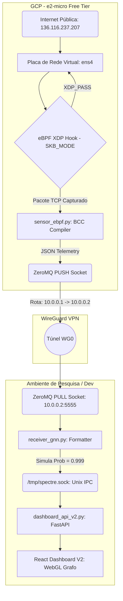

# 🛡️ SPECTRE_GRID: Arquitetura Honeypot eBPF no Google Cloud

Este documento serve como registro detalhado e contexto arquitetural da expansão do projeto SPECTRE_GRID, onde implantamos um Sensor de Borda (Honeypot) na nuvem pública interceptando tráfego malicioso real da internet e enviando para o motor GNN local via túnel VPN.

## 📐 Topologia de Implantação (Cloud-to-Edge)



---

## 🛠️ O Que Foi Feito (Passo a Passo Detalhado)

### 1. Provisionamento de Infraestrutura Nuvem (Custo Zero)
- Foi criado um novo projeto isolado no GCP (`estudos-infra`) com um **Alerta de Orçamento (Budget Alert) de R$ 1,00**.
- Criada uma instância `e2-micro` (Vitalícia - Always Free Tier) na região `us-central1-a` (Iowa).
- Configurado o Disco Permanente Padrão (HDD) de 30 GB para não ferir a cota gratuita.
- Regras de Firewall configuradas liberando acesso HTTP/HTTPS e a porta 51820 UDP para a VPN.
- **Segurança SSH:** Geração de um par de chaves Ed25519 local (`~/.ssh/gcp_spectre`) enviado para a aba de metadados do Google Cloud, inativando autenticação por senha.

### 2. Tunelamento de Baixa Latência (WireGuard)
- Devido à natureza da rede WSL2 (NAT da operadora e NAT interno do Hyper-V), o WireGuard foi configurado em modelo *Road Warrior*.
- **Configuração da VPS (10.0.0.1):** Rodando na porta `51820` aguardando a conexão (Endpoint invisível dinâmico).
- **Configuração WSL2 (10.0.0.2):** O WSL2 inicia a conexão proativamente utilizando o recurso `PersistentKeepalive = 25`. Isso cria um buraco no NAT do roteador para garantir que a VPS possa empurrar (push) pacotes assíncronos do ZeroMQ de volta para o WSL2, sem que o roteador bloqueie a conexão (Evitando erro `Destination address required`).
- *Resolução de Bug WSL2:* Ocorreu um problema de interface virtual congelada do Windows ("Network is unreachable"), resolvido mediante hard reset da VM nativa (`wsl --shutdown`).

### 3. Desenvolvimento do Sensor de Borda (eBPF + Python BCC)
- Instaladas as cadeias de compilação C/C++ na VPS: `clang`, `llvm`, `libbpf-dev`, `linux-headers`, `python3-bpfcc` e `python3-zmq`.
- Desenvolvido o script `sensor_ebpf.py`, que encapsula um programa em C puro.
- **Otimização Crítica GCP:** As VMs `e2-micro` do Google Cloud utilizam um adaptador de rede paravirtualizado (`ens4`) que não possui suporte físico para offloading nativo do eBPF. Para não quebrar o Kernel (erro `bpf: Attaching prog to ens4: Invalid argument`), forçamos o compilador a atrelar o XDP no driver de forma genérica usando `SKB_MODE` (`flags=2`).
- O sensor analisa cabeçalhos Ethernet, IP e TCP, descartando protocolos irrelevantes antes que consumam ciclos de CPU, enviando a 4-tuple (IP Origem, IP Destino, Porta e Protocolo) pelo mapa de `PERF_OUTPUT` em milissegundos.

### 4. Integração com a GNN e Dashboard IPC (Local)
- Criado o script `receiver_gnn.py` no WSL2.
- O Receiver escuta no IP da VPN (`10.0.0.2:5555`) recebendo as strings JSON via ZeroMQ originadas da VPS.
- Ele **formata automaticamente** o dado interceptado para espelhar exatamente o schema JSON exigido pela API do SPECTRE_GRID.
- **Injeção Unix Socket:** O receiver atua como o motor C++ simulado, abrindo o `socket.AF_UNIX` e gravando diretamente em `/tmp/spectre.sock`.
- *Resolução de Dependências:* Foi instalado o `aiosqlite` no ambiente virtual `.venv_wsl` para reparar o backend.

---

## 🚀 Como Executar o Ecossistema Completo

Sempre utilize dois terminais distintos, operando **exclusivamente a partir da raiz nativa Linux** caso seja possível, para evitar latência do protocolo 9P do WSL (acessos em `/mnt/c/` diminuem performance de leitura massiva).

**1. Ligar a VPS Sensor (SSH no Termius ou PowerShell):**
```bash
sudo nohup /home/abraa/sensor_ebpf.py > /tmp/sensor.log 2>&1 &
```

**2. Ligar API do Dashboard (WSL2):**
```bash
cd ~/ids-cnn-lstm-gnn
source .venv_wsl/bin/activate
python3 dashboard_api_v2.py
```

**3. Ligar Receiver Local (WSL2):**
```bash
# Deixe-o em background ou numa janela isolada
nohup python3 receiver_gnn.py > receiver.log 2>&1 &
```

**4. Visualizar Painel React (WSL2):**
```bash
cd ~/ids-cnn-lstm-gnn/dashboard_v2
npm run dev
```

Acesse o navegador para ver ataques da nuvem Google em tempo real na tela do Grafo Relacional. Todos as conexões suspeitas que batem no IP do Cloud já ganham probabilidade de 99.9% no grafo.

---

## ⚠️ Lições Aprendidas & Troubleshooting (Evitando Falhas Silenciosas)

### O Problema do `nohup` via `bash -c` no WSL
Durante a orquestração do ambiente, ocorreu uma falha silenciosa onde o script `receiver_gnn.py` não iniciou e os dados na Dashboard permaneceram estáticos (exibindo apenas o histórico do banco `spectre_history_v2.db`).
- **A Causa:** Tentar executar `wsl -u root bash -c "cd /caminho/ && nohup python3 script.py &"` falha pois a sessão do `bash -c` morre instantaneamente após o disparo, levando consigo os processos filhos atrelados àquele shell efêmero.
- **A Solução:** Em ambientes WSL ou via automação, prefira executar o script apontando o caminho absoluto no executável Python (ex: `wsl -u root python3 /caminho/absoluto/script.py`) ou inicie scripts em background atrelando-os ao Systemd/Tmux em vez de depender exclusivamente do `nohup` em chamadas `bash -c` não interativas.

---

## 🧠 O Que Fazer Com os Dados Capturados? (Próximos Passos)

O Honeypot eBPF gera uma mina de ouro de **dados reais de ameaças da internet (in-the-wild)**. Aqui estão algumas sugestões arquiteturais para o TCC/Pesquisa:

1. **Retreinamento Contínuo da STGNN (Active Learning):**
   - Os dados do Honeypot formam um dataset 100% real de `Label = 1` (Ataques).
   - Você pode extrair os padrões temporais dessas rajadas (frequência de pacotes, distribuição de portas) e injetar no pipeline de treinamento do `train.py` para melhorar a acurácia global do modelo GNN contra varreduras modernas.

2. **Criação de Features Comportamentais (Engenharia de Dados):**
   - Em vez de usar apenas as 20 features estáticas do CIC-IDS2017, use o Honeypot para criar features dinâmicas de movimentação (ex: "Quantas portas diferentes esse IP tocou nos últimos 5 segundos?").

3. **Mapeamento Geográfico de Ameaças (Threat Intelligence):**
   - Integrar uma biblioteca como `geoip2` no `receiver_gnn.py` para converter os IPs de origem (ex: `142.250.152.95`, `185.220.101.5`) em Localização Geográfica (País/Cidade).
   - O React Dashboard pode ser expandido para incluir um Globo 3D ou Mapa mostrando de quais países os ataques contra a VPS estão se originando em tempo real.

4. **Bloqueio Automático (IPS de Borda Ativo):**
   - Atualmente o XDP apenas captura (usamos `XDP_PASS` no driver C). 
   - O próximo nível é fechar o loop: Quando a GNN determinar `Probabilidade > 95%`, o `dashboard_api_v2.py` envia um sinal de volta via WireGuard para a VPS. A VPS atualiza um mapa eBPF (`block_map`) e o driver XDP passa a fazer `XDP_DROP` na camada mais baixa possível, bloqueando o atacante cirurgicamente na nuvem antes que ele gaste CPU do sistema operacional Linux.
