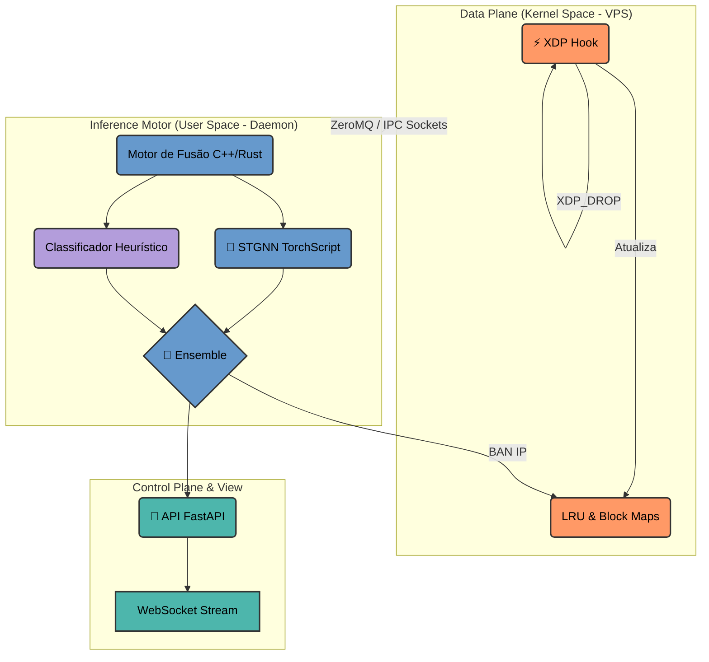

# TAREFA: PRÉ-TCC
**Autor:** Abraão Teixeira
**Projeto:** SPECTRE GRID

---

## Parte 1 - Elementos Pré-Textuais e Metodologia

### Título
SPECTRE GRID: Sistema de Detecção e Prevenção de Intrusão Híbrido Baseado em eBPF/XDP e Inteligência Artificial STGNN

### Resumo
O avanço das tecnologias de rede e a crescente sofisticação dos ataques cibernéticos exigem sistemas de segurança cada vez mais rápidos e inteligentes. Um dos principais desafios enfrentados por infraestruturas modernas é a detecção e mitigação em tempo real de movimentações laterais e anomalias de rede com baixíssima latência. Neste contexto, este trabalho apresenta o projeto SPECTRE GRID, um Sistema de Detecção e Prevenção de Intrusão (IDS/IPS) híbrido de alta performance. A solução proposta integra a tecnologia de filtragem em nível de driver do kernel (eBPF/XDP) com modelos avançados de Inteligência Artificial Gráfica Espaço-Temporal (STGNN). O sistema utiliza um sensor eBPF para capturar tráfego diretamente na placa de rede, realizar sumarização estatística e, se necessário, descartar pacotes maliciosos na casa dos nanossegundos. A classificação de ameaças em camada de aplicação é realizada por uma arquitetura neural baseada no framework PyTorch Geometric, que modela o tráfego da rede como um grafo, permitindo analisar interações topológicas e temporais entre os fluxos. O sistema também integra um painel de controle corporativo desenvolvido em React para visualização em tempo real e auditoria de IA (Explainable AI - XAI). O resultado obtido é um protótipo funcional implementado como *honeypot* em nuvem, capaz de mitigar ameaças ativamente com latência mínima, resolvendo gargalos tradicionais de I/O em soluções IDS legadas.

### Palavras-chave
Cibersegurança; Sistema de Detecção de Intrusão; eBPF; XDP; Redes Neurais em Grafos; STGNN.

### Abstract
The continuous advancement of network technologies and the increasing sophistication of cyber attacks require faster and smarter security systems. One of the main challenges faced by modern infrastructures is the real-time detection and mitigation of lateral movements and network anomalies with ultra-low latency. In this context, this work presents the SPECTRE GRID project, a high-performance hybrid Intrusion Detection and Prevention System (IDS/IPS). The proposed solution integrates kernel-level filtering technology (eBPF/XDP) with advanced Space-Temporal Graph Neural Network (STGNN) models. The system uses an eBPF sensor to capture traffic directly at the network interface, perform statistical summarization, and, if necessary, drop malicious packets in nanoseconds. Threat classification at the application layer is performed by a neural architecture based on the PyTorch Geometric framework, which models network traffic as a graph, allowing the analysis of topological and temporal interactions between flows. The system also integrates an enterprise control panel developed in React for real-time visualization and AI auditing (Explainable AI - XAI). The expected result is a functional prototype implemented as a cloud honeypot, capable of actively mitigating threats with minimal latency, solving traditional I/O bottlenecks in legacy IDS solutions.

### Keywords
Cybersecurity; Intrusion Detection System; eBPF; XDP; Graph Neural Networks; STGNN.

### Introdução

O desenvolvimento da computação distribuída e a ubiquidade da Internet das Coisas (IoT) trouxeram consigo a ampliação da superfície de ataque disponível para agentes maliciosos. A literatura científica contemporânea busca distanciar a intuição do senso comum — característica do conhecimento popular — substituindo-a pelo rigor metodológico do conhecimento científico na área de Ciência da Computação (ARAÚJO, 2004). Sob esse prisma, investigar novas maneiras de analisar tráfego e construir sistemas de prevenção de intrusão constitui um esforço constante da engenharia de software e redes.

A evolução dos firewalls e soluções IDS/IPS (Intrusion Detection and Prevention Systems) muitas vezes se depara com um conflito técnico: o processamento excessivo de dados gerados pelos fluxos modernos impacta o desempenho das redes, ao mesmo tempo que as assinaturas e as antigas regras heurísticas tornam-se ineficazes frente a ataques do tipo "zero-day" ou varreduras distribuídas. A mudança na forma como inspecionamos os dados representa, nos termos de Kuhn (2000), uma transição de paradigma tecnológico na epistemologia computacional, introduzindo filtros dinâmicos diretos na placa de rede, evitando percursos longos até a camada de aplicação.

Este cenário fundamenta a necessidade de arquiteturas inovadoras que unam interceptação de baixíssimo nível (eBPF/XDP) com raciocínio analítico profundo de redes neurais (STGNN).

**Problema de Pesquisa:**
Como desenvolver um Sistema de Detecção e Prevenção de Intrusão capaz de bloquear ataques em tempo real com baixa latência, integrando interceptação em nível de kernel (eBPF/XDP) com inteligência artificial baseada em grafos que compreenda o contexto topológico da rede?

**Objetivo Geral:**
Desenvolver e validar um protótipo funcional de IDS/IPS híbrido e de alta performance, denominado SPECTRE GRID, capaz de detectar e bloquear ataques em tempo real por meio da integração de *kernel hooking* (eBPF/XDP) com Inteligência Artificial Gráfica Espaço-Temporal (STGNN).

**Objetivos Específicos:**
- Implementar filtros e extratores de recursos em nível de kernel utilizando tecnologia eBPF/XDP, interceptando pacotes via *eXpress Data Path*.
- Desenvolver um motor de processamento unificado (daemon C++/Rust) que opere via *ZeroMQ* e Unix Sockets para reduzir a latência e eliminar o I/O de disco físico.
- Projetar e treinar um modelo preditivo STGNN, composto por camadas CNN1D, LSTM e GATConv, para análise relacional de vetores de rede.
- Construir uma interface gráfica interativa (dashboard em React) contendo topologia force-directed em canvas, auditoria do modelo de IA e visualizações em tempo real.
- Avaliar o desempenho empírico através da implantação do sistema operando como um *honeypot* em um ambiente de produção na nuvem.

### Metodologia

Tratando-se de uma pesquisa aplicada focada na criação de um artefato tecnológico, a metodologia adotada será orientada pelo processo de **Design Science Research Process (DSRP)** (PEFFERS et al., 2007). Este paradigma é focado na criação e avaliação de artefatos de TI para a resolução de problemas estruturais, dividindo a pesquisa nas seguintes etapas lógicas:

1. **Identificação do Problema e Motivação:** Revisão sistemática da literatura (GALVÃO; RICARTE, 2019) para evidenciar a problemática de vazamento de latência (*overhead*) nos tradicionais sistemas de IDS quando submetidos a altíssimas taxas de transferência.
2. **Definição dos Objetivos de Solução:** Projeção da arquitetura desacoplada em três frentes: *Data Plane* (eBPF), *Fusion Motor* (daemon) e *Control Plane* (Inteligência Artificial e API).
3. **Design e Desenvolvimento:** Implementação do kernel hook via C (`spectre_xdp.c`), integrando contadores estáticos através de mapas hash bidirecionais. O desenvolvimento neural fará o processamento dos tensores em dimensões tridimensionais `[Nós, Seq_Len=10, Features=20]` via `LibTorch`.
4. **Demonstração e Avaliação:** Configuração do protótipo em uma VPS Google Cloud Platform (GCP) com um túnel WireGuard integrado, expondo-o ativamente como um *honeypot*. A captura massiva analisará métricas críticas como matriz de confusão (F1-Score geral) e latência em milissegundos.
5. **Comunicação:** Redação final do Trabalho de Conclusão de Curso (TCC) fundamentando a proposta teórica, superando desafios arquitetônicos inerentes (como *Concept Drift* na inferência dos pacotes) em conformidade com métricas metodológicas do meio acadêmico.

---

## Parte 2 - Fundamentação Teórica

### 2.1 Quebra de Paradigma em Monitoramento: eBPF e XDP

Tradicionalmente, a filtragem de rede no ecossistema Linux envolvia a passagem do pacote através de uma complexa *stack* TCP/IP. O *Extended Berkeley Packet Filter* (eBPF) e sua extensão *eXpress Data Path* (XDP) subverteram a estrutura legada. A literatura em Ciência da Computação descreve essa transição como uma genuína quebra de paradigma (JACOBINA, 2000), na medida em que a interceptação agora ocorre a nível de placa de rede. 

No projeto SPECTRE GRID, o programa eBPF realiza verificações de segurança atômica instantes após a placa de rede (NIC) registrar a interrupção no anel DMA (*Direct Memory Access*). Através de *Hash Maps* e *LRU Maps*, dados estatísticos vitais (como flags SYN/ACK, bytes e saltos) são sumarizados diretamente na memória RAM em *kernel space*, sem necessidade de cópias inúteis de buffer (Zero-Copy). Quando um fluxo atinge o limite probabilístico de anomalia determinado pela IA, a instrução mitigatória `XDP_DROP` é chamada, garantindo que o atacante veja seu tráfego interrompido em literais nanossegundos. 

Abaixo ilustramos em notação formal o diagrama de fluxo híbrido da solução proposta (kernel para o user-space):

### 2.2 Deep Learning Espaço-Temporal e Auditoria de Ameaças (STGNN)

Abordagens tradicionais de Machine Learning (como Random Forest ou SVM) processam fluxos de dados como ocorrências lineares e singulares, descartando informações essenciais de relacionalidade (SARHAN et al., 2022). Em contraste, o SPECTRE GRID integra Redes Neurais em Grafos Espaço-Temporais (STGNN). Ao modelar IPs globais como vértices de um grafo topológico, o sistema converte tráfego em matrizes adjacentes.

A estrutura neural deste modelo é trifásica:
1. **Camadas CNN1D (Foco Temporal Local):** Escaneiam micro-segmentos sequenciais de 10 em 10 pacotes de um único nó, extraindo anomalias e comportamentos impulsivos que sugerem quebra da normalidade;
2. **Camadas LSTM (Long Short-Term Memory):** Atuam retendo e inferindo as correlações históricas temporais do *flow* longo, ajudando na categorização de furtividade temporal (como Scans persistentes ao longo de minutos);
3. **Graph Attention Networks (GATConv):** Realizam a difusão espacial (*Message Passing*). Com suporte aos pesos de atenção, o algoritmo calcula o vetor de probabilidade de um terminal estar tentando comprometer ("saltar" para) máquinas adjacentes numa rede interna.

Por intermédio da auditoria explicável (*Explainable AI*), os pesos da rede GATConv são realimentados no WebSocket em tempo real para visualizações na camada WebGL do Dashboard, retirando as capacidades de detecção do escopo de "caixa-preta" tecnológica para o domínio da engenharia auditável. Dessa forma, o conhecimento validado afasta-se de conjecturas ou "achismos" sensoconsuetudinários da rede (ARAÚJO, 2004), substituindo-os por certezas matemáticas vetoriais em defesas perimetrais.

---

## Referências

ARAÚJO, Carlos Alberto Ávila. A ciência como forma de conhecimento. In: ARAÚJO, C. A. A. **A ciência como forma de conhecimento**. *[S. l.: s. n.]*, 2004. Material de estudo disponibilizado em ambiente virtual de aprendizagem.

DAVIDSON, Andrew; DELBRIDGE, Elizabeth. How to write a research paper. **Paediatrics and Child Health**, v. 22, n. 2, p. 61-65, 2012.

GALVÃO, Maria Cristiane Barbosa; RICARTE, Ivan Luiz Marques. Revisão sistemática da literatura: conceituação, produção e publicação. **Logeion: Filosofia da informação**, v. 6, n. 1, p. 57-73, 2019.

JACOBINA, Ronaldo Ribeiro. O paradigma da epistemologia histórica: a contribuição de Thomas Kuhn. **História, Ciências, Saúde-Manguinhos**, Rio de Janeiro, v. 6, n. 3, p. 609-630, 2000. DOI: https://doi.org/10.1590/S0104-59702000000400006.

PEFFERS, Ken; TUUNANEN, Tuure; ROTHENBERGER, Marcus A.; CHATTERJEE, Samir. A design science research methodology for information systems research. **Journal of management information systems**, v. 24, n. 3, p. 45-77, 2007.

SARHAN, Mohanad et al. Towards a standard feature set for network intrusion detection system datasets. **Mobile Networks and Applications**, v. 27, n. 1, p. 357-370, 2022.
