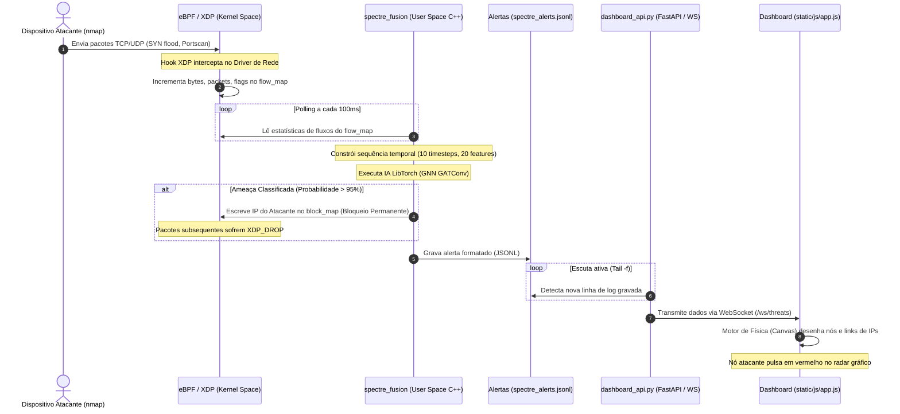

# Plano de Implementação e Fluxo de Dados: Dashboard & Fusão SPECTRE_GRID

Este plano redefine e documenta a arquitetura de ponta a ponta do sistema, detalhando o funcionamento integrado do **Sensor eBPF**, do **Motor de Fusão C++ (LibTorch)**, da **API WebSocket (FastAPI)** e do **Dashboard Web (Canvas/Physics)**.

---

## 1. Como Tudo Funciona (O Pipeline de Dados)

O sistema opera de forma assíncrona através de um padrão Produtor-Consumidor acoplado ao Kernel Linux:



---

## 2. Passo a Passo para Subir o Sistema

Para que tudo funcione corretamente, os processos devem ser iniciados na seguinte sequência:

### ⚙️ Processo 1: O Consumidor (Dashboard FastAPI)
Responsável por servir o front-end HTML/CSS/JS e escutar as alterações no arquivo de logs para transmiti-las via WebSocket.
* **Onde rodar:** No terminal WSL do Linux (diretório nativo do WSL).
* **Comandos:**
  ```bash
  cd /home/abras/ids-cnn-lstm-gnn
  source .venv_fast/bin/activate
  python3 dashboard_api.py
  ```
* **Verificação:** Acesse `http://localhost:8000` no seu Windows. O painel deve abrir em estado seguro, com a luz **LISTEN** ligada (indicando conexão WebSocket ativa).

### ⚙️ Processo 2: O Produtor (Motor C++ & eBPF)
Responsável por acoplar o bytecode eBPF ao driver da interface de rede (`eth8`), coletar dados estatísticos, alimentar a inteligência artificial do LibTorch e escrever os alertas no log.
* **Onde rodar:** Em um **segundo terminal** do Linux (diretório nativo do WSL, como `root/sudo`).
* **Comandos:**
  ```bash
  cd /home/abras/ids-cnn-lstm-gnn/build
  sudo ./spectre_fusion eth8
  ```
* **Verificação:** O terminal deve carregar as extensões `torch_scatter/torch_sparse`, instanciar o modelo `spectre_model_scripted.pt` e exibir `[SPECTRE-GRID] XDP anexado`.

### ⚙️ Processo 3: O Disparador (Ataque Externo)
Responsável por gerar o tráfego que o sistema detectará.
* **Onde rodar:** Do seu celular ou de outro computador na mesma rede Wi-Fi.
* **Comandos (nmap apontando para o IP do WSL):**
  ```bash
  nmap -T4 -F 192.168.100.5
  ```

---

## 3. Plano de Verificação e Diagnóstico de Falhas

Se você executar o ataque e o grafo continuar estático, siga esta matriz de teste:

| Sintoma | Causa Provável | Solução |
| :--- | :--- | :--- |
| **Nenhum nó surge na tela** | O arquivo `data/logs/spectre_alerts.jsonl` está vazio. | Verifique se o `spectre_fusion` ou o `continuous_flow_generator.py` está rodando e gravando entradas. |
| **Erro "Cannot load model" no C++** | O binário foi chamado fora da pasta `build`. | Execute o C++ obrigatoriamente dentro da pasta `/home/abras/ids-cnn-lstm-gnn/build`. |
| **Erro de permissão eBPF** | O motor C++ foi rodado sem `sudo`. | O kernel impede a inserção de hooks XDP sem privilégios de administrador. Use `sudo ./spectre_fusion eth8`. |
| **Ataque nmap não gera logs** | O IP do WSL mudou ou o celular está em rede diferente. | Verifique o IP atual da `eth8` rodando `ip addr show eth8`. Certifique-se de que o dispositivo externo pinga este IP. |
