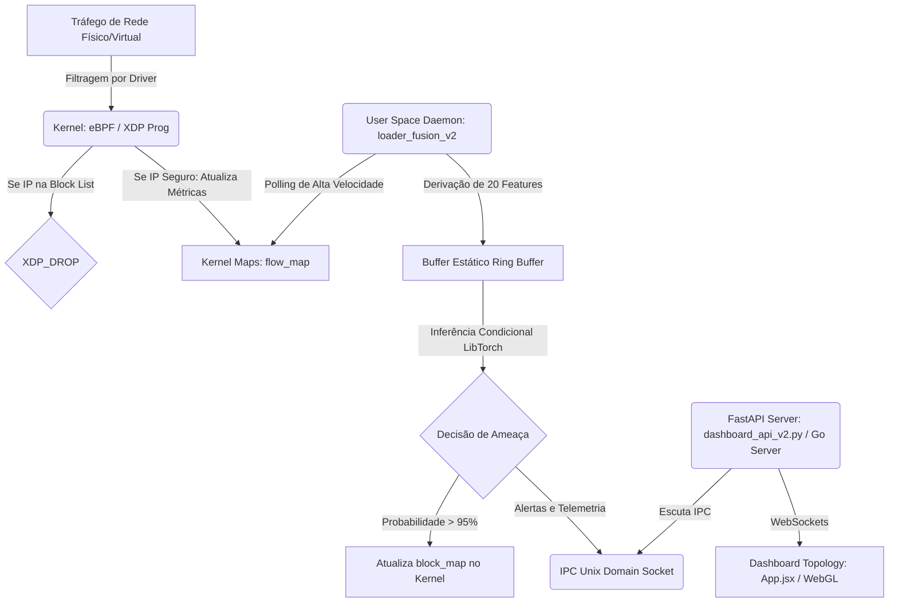

# 🔬 Visão Geral do Projeto: SPECTRE_GRID

O **SPECTRE_GRID** é um Sistema de Detecção e Bloqueio de Intrusão (IDS/IPS) híbrido de alta performance, projetado para monitorar movimentações laterais e anomalias de rede em tempo real. O projeto combina conceitos avançados de **Kernel Hooking (eBPF/XDP)** com **Inteligência Artificial Gráfica Espaço-Temporal (STGNN)**.

---

## 1. Arquitetura Geral do Sistema (Fluxo de Dados)

O sistema opera no modelo **Produtor-Consumidor** de três camadas para garantir latência ultra-baixa de nível industrial:

---

## 2. Componentes de Software e Inteligência Artificial

### A. O Modelo Neuronal (`model.py` / `spectre_model_scripted.pt`)
A arquitetura do modelo `SPECTRE_GRID` é baseada no artigo científico *ICICNIS-2024* de Ananthi et al. Ela processa tensores tridimensionais com o shape `[Nós, Seq_Len=10, Features=20]`:
1. **CNN1D:** Extrai padrões de tráfego temporais locais das Top-20 features por nó.
2. **LSTM:** Captura correlações temporais de longo prazo entre as sequências de pacotes.
3. **GATConv (GNN com Atenção):** Realiza o *Message Passing* espacial/topológico. Os nós são os endereços IPs e as arestas são os fluxos ativos, permitindo detectar movimentações laterais e varreduras de rede de forma relacional.
4. **Classificador Totalmente Conectado (FC):** Gera um logit binário por nó (usando `BCEWithLogitsLoss` no treino para contornar o desbalanceamento de dados).

### B. Engenharia e Pré-processamento (`preprocessor.py` & `train.py`)
* **Seleção de Features:** Executa One-Hot Encoding em colunas de protocolo, serviço e flags. Seleciona automaticamente as **Top-20 Features** com maior correlação linear absoluta (Pearson) em relação à coluna alvo (*target*).
* **Construção do Grafo:** Converte os fluxos em um objeto `Data` do PyTorch Geometric, gerando uma representação topológica real da rede baseada nos IPs de origem e destino.
* **Resiliência de Dados:** O modelo foi validado inicialmente com dados legados e evoluiu para a adoção do dataset **CIC-IDS2017 Full Processed**, garantindo resiliência e validação contra vetores de ataques modernos (DDoS, PortScan, Web Attacks).

---

## 3. Segurança Nível Kernel: eBPF e XDP

### A. Captura no Driver (`ebpf/spectre_xdp.c`)
Código escrito em C que é compilado para bytecode e injetado diretamente no driver de rede (nível XDP):
* **Filtro Rápido:** Consulta o mapa Hash `block_map`. Se o IP de origem estiver na lista, o pacote é imediatamente descartado (`XDP_DROP`) antes de subir para a pilha de rede do Linux, neutralizando ataques com custo computacional mínimo.
* **Agregador Estatístico:** Mantém contadores atômicos (`packets`, `bytes`, contagem de flags TCP SYN, ACK, FIN, RST) associados a uma chave de fluxo (5-tuple: IP Origem, IP Destino, Portas e Protocolo) dentro do mapa LRU `flow_map`.

### B. O Motor de Fusão (`ebpf/loader_fusion_v2.cpp`)
Um daemon em C++ que une o eBPF à IA do LibTorch:
* **Stack Operation (Zero Alocação Dinâmica):** Utiliza arrays estáticos no *hot loop* para evitar consumo excessivo de memória no heap.
* **Algoritmo de Welford:** Calcula médias e desvios padrão dinâmicos (*online Z-score*) para normalizar as features antes de injetá-las no modelo.
* **Inferência Condicional:** Só aciona o modelo se o fluxo possuir ao menos 10 medições temporais acumuladas no ring buffer, reduzindo a sobrecarga da CPU.

---

## 4. O Visualizador e Dashboard (`dashboard_api_v2.py` & `dashboard_v2/`)

* **Interface Visual de Alto Padrão:** O dashboard foi desenvolvido com estética voltada à cibersegurança (modo escuro com realces neon e animações fluidas).
* **Visualização da Topologia GNN (`App.jsx`):** Um motor de física de grafos direcionados (*Force-Directed Graph Layout*) renderiza os IPs como nós dinâmicos no Canvas HTML5 em tempo real. Recentemente recebeu atualizações nas regras físicas anti-aglomeração para suportar ataques massivos (ex: DDoS) sem quebra de estabilidade.
* **Ingestão Leve e Persistência:** Utiliza WebSockets no FastAPI para telemetria ao vivo e introduz banco de dados local SQLite (`spectre_history_v2.db`) para persistir o histórico de ameaças de longo prazo.

---

## 5. Infraestrutura de Deploy Enterprise

A pasta `deploy/` concentra os esforços recentes para provisionar o SPECTRE_GRID como um sistema contínuo em ambientes de produção.
* **Systemd Services:** Contém unidades do Linux (`spectre-api.service`, `spectre-fusion.service`, `spectre-web.service`) que isolam e executam as camadas do sistema nativamente em background como *daemons*.
* **Automação:** O script `install_services.sh` garante uma instalação e orquestração limpa.

---

## 6. Regras de Safe Deploy e Operações do Repositório

Conforme as restrições documentadas nos arquivos `project_state.md` e `fusion_changelog.md`:

1. **Arquivos Intocáveis (Safe Deploy):**
   * Os arquivos originais do motor de inteligência (`main.cpp`) e do carregador eBPF isolado (`ebpf/loader.cpp`) devem permanecer sem modificações.
   * Novas lógicas de fusão devem ser mantidas exclusivamente no `ebpf/loader_fusion.cpp`.
2. **Modificações de IA:**
   * Alterações em `model.py` e `train.py` necessitam de aprovação explícita.
3. **Ambiente de Execução (Regra de Ouro do WSL2):**
   * O projeto **deve ser executado e compilado dentro da raiz nativa do Linux** (`~/ids-cnn-lstm-gnn/`) no WSL2. O acesso através do diretório montado `/mnt/c/` é estritamente proibido para operações de Machine Learning e compilação, a fim de evitar bugs de I/O causados pela latência do sistema de arquivos Windows-Linux.
